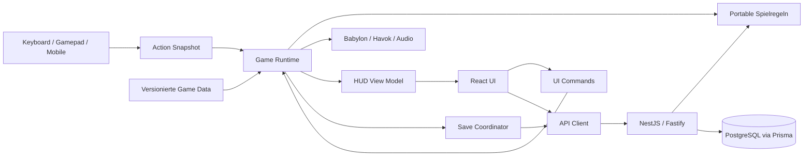

# Architektur

Status: gewählter Zielentwurf; die technische Umsetzung und Versionsprüfung beginnen in Phase 0. [Projektplan](IMPLEMENTATION_PLAN.md) · [Spielregeln](GAME_DESIGN.md) · [Daten/API](docs/api/data-and-api.md)

## 1. Engine-Entscheidung: Babylon.js

Der Vergleich bewertet die Integrationsarbeit für dieses Spiel. Er ist keine allgemeine Rangliste und kein gemessener Performancevergleich.

| Kriterium            | Babylon.js                                                                                           | Three.js                                                                                 | Bewertung für Tobi                                                      |
| -------------------- | ---------------------------------------------------------------------------------------------------- | ---------------------------------------------------------------------------------------- | ----------------------------------------------------------------------- |
| Character Controller | Havok-basierter `PhysicsCharacterController` mit Kapsel, Support-Abfrage und kontrollierter Bewegung | Controller wird mit einer Physikbibliothek oder eigener Kollisionslösung zusammengesetzt | Babylon spart Adapterarbeit; Steuergefühl bleibt Eigenentwicklung       |
| Animation            | Animationssystem, Skelette, AnimationGroups und Blending                                             | AnimationMixer, Clips und Actions mit Blending                                           | Beide geeignet; beide brauchen unsere Zustandslogik                     |
| Physik               | offizielle Havok-Integration in Physics V2                                                           | Integration eines separaten Physiksystems                                                | Babylon passt zum gewünschten Engine-Umfang                             |
| Kollisionen          | Physikabfragen und zusätzlich native Kollisionsfunktionen                                            | geometrische Abfragen vorhanden, physische Auflösung über weitere Komponenten            | Für das Projekt genau eine Physikwelt verwenden                         |
| Asset Loading        | glTF/GLB-Loader und AssetContainer                                                                   | GLTFLoader, LoadingManager und Decoder-Anbindung                                         | Beide ausreichend; eigener Manifest-/Cache-Layer bleibt nötig           |
| Scene Management     | Scene, Container und explizites Dispose                                                              | Scene-Graph; Lifecycle und Ressourcenverwaltung anwendungsspezifisch                     | Babylon bietet mehr Bausteine, Levelwechsel trotzdem selbst modellieren |
| Debugging            | Inspector und Playground als integriertes Ökosystem                                                  | DevTools, Beispiele und ergänzende Werkzeuge                                             | Babylon erleichtert visuelles Untersuchen der Spielszene                |
| Browser              | WebGL und WebGPU als Engine-Pfade                                                                    | WebGLRenderer verwendet WebGL 2; separater WebGPU-Pfad verfügbar                         | Browsermatrix und Gerätetests entscheiden; WebGPU nicht voraussetzen    |

Babylon dokumentiert Physik, Animation, Szene und Renderpfade in den [Engine-Spezifikationen](https://www.babylonjs.com/specifications/). Der [Character-Controller-Leitfaden im offiziellen Repository](https://github.com/BabylonJS/Documentation/blob/master/content/features/featuresDeepDive/physics/v2/characterController.md) beschreibt Support, Geschwindigkeitsvorgabe und Integration. Die [Havok-Integration](https://github.com/BabylonJS/havok) initialisiert die WASM-Runtime asynchron. Diese Fakten begründen die Auswahl; unsere erwartete Zeitersparnis ist eine Projektbewertung.

Three.js bietet mit [AnimationMixer](https://threejs.org/docs/pages/AnimationMixer.html) und [GLTFLoader](https://threejs.org/docs/pages/GLTFLoader.html) geeignete Animations- und Asset-Bausteine. Der [WebGLRenderer](https://threejs.org/docs/pages/WebGLRenderer.html) setzt WebGL 2 voraus. Es wäre eine gute Alternative für eine stärker selbst zusammengestellte Runtime; für den verlangten Funktionsumfang wählen wir Babylon. In Phase 1 prüfen wir die konkrete Babylon-/Havok-Kombination an Kapselbewegung, Stufen, Kamera-Sweeps, WASM-Laden und Safari. Bei einem unlösbaren Controllerproblem wird zuerst der Physikadapter untersucht; ein Enginewechsel benötigt eine neue ADR.

## 2. Gesamtsystem

HTTP ist ausserhalb des Simulationsticks. Das Backend simuliert keine NPCs, keine Kamera und keine Physik. Shared Code enthält Regeln und Schemas; das Teilen einer Funktion macht Clientmeldungen nicht vertrauenswürdig.

## 3. Frontend und Lifecycle

React + Vite liefern Startbildschirm, Auth, Levelauswahl, HUD, Pause, Einstellungen, Shop und Ergebnisansicht. React erstellt genau eine `GameHost`-Instanz pro Canvas-Mount. Der Host besitzt Engine und aktuelle Session. Mount/Unmount, auch im React-Entwicklungsmodus, müssen idempotent sein.

Die Spielzustände lauten `BOOT → MENU → LOADING → PLAYING ↔ PAUSED → RESULTS`, mit `RECOVERABLE_ERROR` für Lade-/Grafikfehler. Ein Levelwechsel verwirft die alte Session vollständig, behält aber gemeinsam referenzierte Assets im Cache. Asynchrone Loader bekommen Abort-Signal und Generation-ID: ein verspätetes Loader-Ergebnis darf keine bereits beendete Szene aktivieren.

Babylon rendert imperativ. Keine React-Komponente pro Flasche oder Frame; keine Spielerposition in React-State. Ein `GameViewStore` veröffentlicht unveränderliche HUD-Snapshots bei Änderungen, kontinuierliche Anzeigen höchstens etwa 10–20 Mal pro Sekunde. React liest über `useSyncExternalStore`; Animationen von UI-Balken übernimmt CSS. Netzwerkzustand bleibt in der UI-/API-Schicht. Ein allgemeiner globaler State-Container ist im MVP nicht nötig.

## 4. Simulation, Zeit und Events

Ein `SimulationClock` verwendet feste Schritte von 1/60 Sekunde mit Akkumulator; maximal fünf Nachholschritte pro Renderframe begrenzen Lastspitzen. Die Physik wird pro Simulationsschritt genau einmal über den Adapter ausgeführt. Babylons Renderloop darf daneben keine zweite automatische Physikfortschaltung verursachen; Phase 1 überprüft diese Integration ausdrücklich. Zwischen Zuständen wird für die Darstellung interpoliert.

Tick-Reihenfolge: Actions übernehmen → Commands prüfen → Effekte und Bewegungsabsicht → NPC-/Police-Entscheidungen auf ihrem jeweiligen Takt → Character/Physik → Kontakte und Wahrnehmungsergebnisse → bestätigte Gameplay-Events → Mission/Chaos/Wanted/Combo/Score → Snapshot/Audio/Rendering. Systemreihenfolge ist explizit, testbar und kein zufälliges Importresultat.

Pro Session gibt es eine begrenzte typisierte Event-Queue. Events enthalten `eventId`, `runId`, `attemptEpoch`, `tick`, `type`, `sourceId` und typspezifische Nutzdaten. Beispiele: `ItemCollected`, `NoiseEmitted`, `IncidentWitnessed`, `PursuitStarted`, `PursuitEscaped`, `ObjectiveCompleted`, `CheckpointReached`. Ein Command fordert eine Aktion an; erst nach erfolgreicher Prüfung entsteht ein Event. Dadurch zählt eine abgelehnte Aufnahme nicht als Score oder Missionserfolg.

Ereignisse werden an festen Phasengrenzen abgearbeitet; neue Folgeereignisse gehen in die nächste passende Phase und lösen keine rekursiven Dispatch-Ketten aus. Interaktions-IDs und Pickup-IDs erlauben Deduplizierung. Kein globaler Service-Locator, keine beliebigen Event-Strings, keine dauernde Eventflut pro Position.

Es gibt getrennte Zeitgrössen:

- **aktive Spielzeit:** pausiert im Menü/bei Tab-Verlust; Grundlage für Run-Zeit, Combo und Effektlaufzeiten;
- **Actor-Zeitfaktor:** Focus verlangsamt definierte NPC-/Verkehrsaktionen, während Tobi und Kamera reaktionsfähig bleiben;
- **Serverzeit:** Sessionablauf, Requestfristen und Plausibilitätsgrenzen; niemals durch Clientpause kontrolliert.

Focus verändert nicht global die Havok-Schrittweite. Es skaliert Ziele, Animationen und Aktionsfrequenzen betroffener Akteure; eine einzige stabile Physikwelt verarbeitet deren reduzierte Geschwindigkeiten. Das verhindert widersprüchliche Kollisionszeiten. Keine browserübergreifende deterministische Physik wird versprochen. Logiktests verwenden kontrollierbare Uhren und RNG-Seeds.

Bei `visibilitychange`, Fokusverlust oder verlorenem Pointer Lock pausiert das Singleplayer-Spiel, setzt gehaltene Inputs zurück und zeigt Fortsetzen. Hintergrundzeit verursacht keine nachgeholte Verfolgung. Technisches Überlastungs-Zeitverwerfen wird erfasst; entsprechende Runs sind für spätere Zeitranglisten ungeeignet.

## 5. Modulgrenzen und Zustandsbesitz

| Modul            | Verantwortung/eigener Zustand                        | Öffentliches Interface                  | Isolierter Nachweis             |
| ---------------- | ---------------------------------------------------- | --------------------------------------- | ------------------------------- |
| Core/Session     | Uhr, Scheduler, Lifecycle, RNG, Event-Phasen         | `start`, `pause`, `step`, `dispose`     | Fake Clock, feste Ereignisfolge |
| Input            | Geräte, Bindings, Kontexte                           | `sampleActions`, `setContext`           | virtuelle Geräte, Fokusverlust  |
| Character        | Position, Geschwindigkeit, Stamina, Bewegungszustand | `applyIntent`, `readCharacter`          | Fake Motor + Physik-Testarena   |
| Camera           | Yaw, Pitch, Abstand, Hinderniskorrektur              | `setTarget`, `updateView`               | Probe-Geometrien                |
| Physics          | Bodies, Collider, Layer, Ray-/Shape-Abfragen         | `CharacterMotor`, `PhysicsQueries`      | Browser mit Havok               |
| Items            | Pickup-Instanzen, Effektinstanzen, Wurflebensdauer   | `tryCollect`, `tryUse`, `tryThrow`      | Fake Inventory/Clock            |
| Inventory        | Run-Bestände und Auswahl                             | `tryAdd`, `tryConsume`, `selectNext`    | Grenzen und Atomizität          |
| Missions         | Objective-Graph und Fortschritt                      | `onEvent`, `snapshot`, `restore`        | Handler-Fixtures                |
| NPC              | zivile FSM, Dialog-/Reaktionszustand                 | `interact`, `react`, `readNPC`          | Fake Perception/Navigation      |
| Police           | individuelle FSM und Perception-Memory               | `setAssignment`, `readAIState`          | Übergangstabellen               |
| Pursuit Director | Gruppenwissen, Einsatzbudget, Flucht-Timer           | `reportSighting`, `requestBackup`       | Multi-Officer-Szenarien         |
| Vehicles         | Sitzplatz, Geschwindigkeit, Fahrerzustand            | `enter`, `exit`, `driveIntent`          | Fake Vehicle Motor              |
| Chaos            | Heat-Wert und Darstellungsband                       | `applyIncident`, `tick`, `readChaos`    | Grenzen, Abbau, Hysterese       |
| Wanted           | Sterne, bestätigte Suche und Eskalations-Cap         | `confirmIncident`, `resolveEscape`      | Cap-/Escape-Regeln              |
| Combo/Score      | qualifizierte Kette und Ereigniswertung              | `onScorableEvent`, `finalize`           | Golden-Result-Fixtures          |
| Levels           | Content-Instanziierung, Trigger, Spawn-/Zugangsgraph | `load`, `activate`, `unload`            | ungültige Referenzen/Lifecycle  |
| Audio            | Busse, Prioritäten, Musikintensität                  | `playCue`, `setIntensity`               | Fake Audio Sink                 |
| Save Coordinator | Outbox, Revision, Syncstatus                         | `queueCheckpoint`, `finishRun`, `retry` | Fehler-/Retry-Sequenzen         |
| UI               | Screens, Accessibility, View Models                  | Commands und readonly Snapshots         | Komponenten-/E2E-Tests          |

`Police` schreibt nie direkt `wantedLevel`, `Mission` setzt keine Spielerposition und React greift nicht in die Physikwelt. Eine Karltür wird über einen registrierten World-Command geöffnet. Die Zusammensetzung der Systeme lebt im Composition Root, die Logik in den jeweiligen Modulen.

## 6. Shared Packages und Importregeln

| Package            | Inhalt                                                                   | Erlaubte Abhängigkeiten                     |
| ------------------ | ------------------------------------------------------------------------ | ------------------------------------------- |
| `@tobi/contracts`  | Runtime-validierbare Schemas, abgeleitete TS-Typen, Events, DTOs, IDs    | kleine Schema-Bibliothek, kein DOM/Node/ORM |
| `@tobi/game-core`  | reine Chaos-/Combo-/Score-/Mission-/Inventory-Regeln, FSM-Logik, Ports   | contracts                                   |
| `@tobi/game-data`  | JSON-Inhalte, Definitionen, Balancing, Lokalisierung, Manifestreferenzen | contracts; kein game-core-Import            |
| `@tobi/api-client` | typisierte HTTP-Funktionen, Fehlerabbildung, Abort/Timeout               | contracts; injizierbares fetch              |
| `@tobi/database`   | Prisma-Schema, Migrationen, Seed, generierter Client                     | Prisma, serverseitige Definitionen          |
| `@tobi/config`     | ESLint-/TypeScript-/Test-Konfiguration                                   | nur Entwicklungswerkzeuge                   |

`contracts` ersetzt das vorgeschlagene `game-types`: Typen werden aus Schemas abgeleitet, damit HTTP und JSON auch zur Laufzeit geprüft werden. Zod ist der vorgesehene Schema-Ansatz; Phase 0 prüft eine einheitliche JSON-Schema-/OpenAPI-Ausgabe. Keine parallel handgepflegten Nest-DTO-Klassen. Prisma-Datensätze sind interne Persistenzmodelle und werden explizit auf die öffentlichen DTOs abgebildet; `password_hash` erscheint nie in einem `User`-DTO.

Subpath-Exports wie `@tobi/game-core/chaos` und `@tobi/contracts/savegames` verhindern einen wachsenden zentralen Barrel. Kein leeres `utils`-Sammelpaket: Hilfsfunktionen bleiben fachlich lokal, bis echte Wiederverwendung belegt ist. Backend und Client dürfen contracts, core und data verwenden; nur das Backend importiert database. Die Prüfung von Content-Referenzen gegen registrierte Handler erfolgt im Tool, das beide kennt, damit kein Abhängigkeitszyklus entsteht.

ESLint-/Dependency-Graph-Checks erzwingen keine Cross-App-Imports, keine privaten Deep Imports, keine Engineimporte in game-core und keine Node-/Databaseimporte im Browser. Innerhalb eines Featurebereichs besitzen Daten, Services und Adapter getrennte Dateien. Ein Richtwert von 150–300 Zeilen macht Reviews handhabbar; fachlicher Zusammenhang hat Vorrang vor mechanischem Aufteilen.

## 7. Input und Character Controller

`InputSource` liefert ein `ActionSnapshot`: `move(x,y)`, `look(dx,dy)`, gedrückte/gehaltene/losgelassene Zustände für `jump`, `sprint`, `interact`, `useItem`, `nextItem`, `throwItem`, `special`, `pause`. KeyboardInput ist die erste Implementierung; GamepadInput und MobileInput folgen später mit derselben Semantik. Ein Action-Mapping berücksichtigt Deadzones, Sensitivität und Remapping.

Kontexte `gameplay`, `vehicle`, `dialog`, `menu` verhindern etwa einen Wurf beim Tippen. Die Mouse-Look-Aktion nutzt relative Pointer-Lock-Deltas; Menü und ESC geben die Maus frei. Pointer Lock und Audio beginnen nach Nutzergeste. Der aktive Inputtyp bestimmt Prompts, nicht die Character-Klasse.

Der Character Controller zerfällt in geräteunabhängige `CharacterIntent`, testbare Locomotion-/Stamina-Regeln, `CharacterMotor`-Port und Havok-Adapter. Kapselmasse, Step-Höhe, Ground-Probe, Hangneigung, Beschleunigung und Air Control sind Daten. Das sichtbare korpulente Mesh kann wackeln und stolpern; die Kapsel bleibt für faire Kollisionen stabil.

Bewegung ist relativ zur horizontalen Kameraausrichtung; diagonale Eingabe wird normiert. Ausgangswerte: Laufen 4,2 m/s, Sprint 7,5 m/s, Jump etwa 1,2 m, Coyote Time 100 ms und Jump Buffer 120 ms. Grounding, Head-Collision, Rutschen an Wänden, Treppen und bewegliche Untergründe bekommen Testfälle. Keine Root-Motion als Autorität im MVP; Animation folgt gemessener Motorbewegung. Maximalgeschwindigkeit und Sweeps begrenzen Tunneling bei Boosts.

Stamina startet bei 100, Sprint kostet 22/s, Regeneration 16/s nach 0,8 s ohne Sprint. Erschöpfung benötigt mindestens 20 Stamina zum erneuten Sprint. Im bestätigten Chase aktiviert sich ein einmaliger Adrenalinschub pro Verfolgung: zwei Sekunden reduzierte Sprintkosten, klar visualisiert. Alle Werte sind Balancing-Daten.

## 8. Kamera und Animation

Ein eigenes Third-Person-Rig kombiniert orbitale Eingabe mit gedämpftem Follow-Pivot auf Oberkörperhöhe. Vorgabe: 4,5 m Abstand, 65° FOV und begrenzter Pitch. Eine Sphere-/Shape-Abfrage vom Pivot zur Sollposition verkürzt den Abstand vor Wänden; beim Freigeben fährt die Kamera langsam zurück. Ein kleiner Radius verhindert Eck-Clipping besser als ein einzelner Strahl. Visual-Only-Verdeckungen dürfen ausblenden; Kollisionsgeometrie bleibt bestehen.

FOV-Ausweitung bei Sprint, Kamerawackeln und schnelle Schwenks sind sparsam und abschaltbar. In Innenräumen gelten kamerabezogene Level-Zonen als Daten. Fahrzeuge verwenden ein anderes Rig-Profil hinter demselben Camera-Port. Bei Teleport/Respawn wird die Dämpfung zurückgesetzt. Mausinvertierung, Sensitivität, FOV und Shake gehören zu Settings.

Die Animation besitzt eine Basis-Locomotion-Schicht (`idle`, `walk`, `run`, `sprint`, `jump`, `exhausted`) und priorisierte One-shots/Gesten: Stolpern, Aufnehmen, Flasche/Power-up benutzen, Werfen, Sprechen, panisches Umschauen, Entdecktwerden, Feiern und Victory Dance. Gameplay-Folgen kommen aus Commands und bestätigten Events, nicht ausschliesslich aus Animation-Callbacks. So bleibt fehlendes Assetmaterial im Prototyp funktionsfähig. Animationen können den Wurfzeitpunkt kosmetisch begleiten; Itemverbrauch bleibt atomar und nur einmal möglich.

## 9. Backend-Entscheidung und Modulaufbau

| Wahl               | Stärke                                                                       | Kosten                                                             | Entscheidung                                    |
| ------------------ | ---------------------------------------------------------------------------- | ------------------------------------------------------------------ | ----------------------------------------------- |
| Fastify direkt     | kleine Basis, Plugin-Kapselung, freie Struktur                               | Team muss Modulkonventionen, DI und Testgrenzen selbst vereinbaren | valide Alternative für ein kleines Backend-Team |
| NestJS             | verbindliche Module/Provider, Dependency Injection, einheitliche Erweiterung | mehr Frameworkkonzepte und etwas Boilerplate                       | gewählt für langfristige Zusammenarbeit         |
| NestJS mit Fastify | Nest-Fachstruktur, Fastify-HTTP-Integration                                  | Adapter-/Plugin-Kompatibilität prüfen                              | gewähltes Deployment                            |

Nest kapselt Provider über explizite Modul-Exports; dies passt zu unseren Teamgrenzen. Fastify bietet ebenfalls echte Kapselung und ist nicht grundsätzlich schlechter wartbar. Die Auswahl folgt dem Bedarf nach gemeinsamen Konventionen. Quellen: [Nest-Module](https://docs.nestjs.com/modules), [Fastify Encapsulation](https://fastify.dev/docs/latest/Reference/Encapsulation/). Der offizielle [Nest-Fastify-Adapter](https://docs.nestjs.com/techniques/performance) erfordert passende Fastify-Pakete anstelle von Express-Middleware. Ein pauschaler Geschwindigkeitsvorteil für unsere API wird daraus nicht abgeleitet.

Module: `auth`, `users`, `savegames`, `runs`, `progress`, `inventory`, `achievements`, `highscores`, `settings`, `content`, `health`. Ein Feature hat Controller → Application Service → fachliche Regeln → Repository. Transactions liegen im Anwendungsfall, besonders bei Run-Abschluss; Repository-Aufrufe eröffnen keine konkurrierenden Einzeltransaktionen.

Keine Microservices, Queue-Plattform oder Redis im MVP. PostgreSQL hält auch Sessions und Idempotenzdaten. Ein Nest-Provider kapselt Prisma, ein globaler Fehlerfilter erzeugt stabile API-Fehler, strukturierte Logs führen Request-IDs. Geschäftslogik hängt nicht vom HTTP-Requestobjekt ab. Der genaue Speicher-/Security-Vertrag steht in [Daten und API](docs/api/data-and-api.md).
