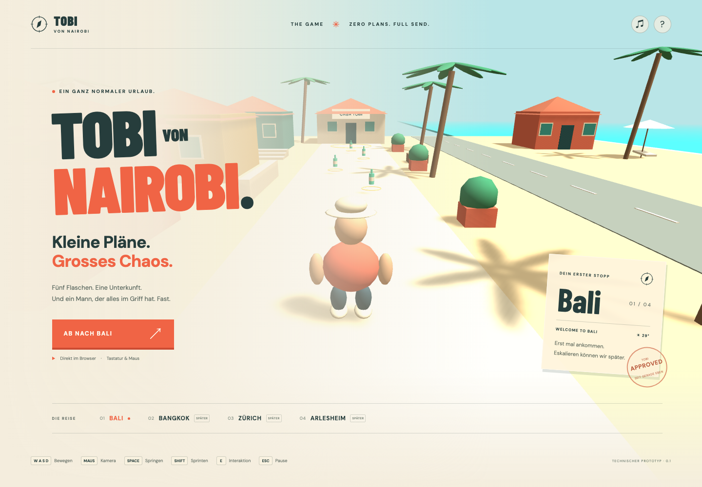

# TOBI VON NAIROBI – The Game

Repository: [samuelheinrich/tobi-von-nairobi](https://github.com/samuelheinrich/tobi-von-nairobi). Geplante Produktionsdomain: **https://tobi-von-nairobi.ch**. DNS, Hosting und Deployment sind noch nicht eingerichtet; die lokale Entwicklung verwendet weiterhin localhost.

Kleine Pläne. Grosses Chaos. Ein humorvolles 3D-Third-Person-Arcade-Spiel für den Browser.

**Aktueller Stand: vier spielbare Bali-Level mit insgesamt 35 Flaschen.** Neben Tutorial und Bali Escape gibt es **Beach Bar** (10 Flaschen) und **Bali Night Market** (15 Flaschen), auswählbar über **LEVEL WÄHLEN** auf der Zielkarte. Tobi schwankt nach jeder Flasche stärker, bewegt Arme und Beine übertriebener und stolpert sichtbar. Neue Soundeffekte begleiten Schritte, Sprünge, Pickups und Verfolgungen. Registrierung, Login und dauerhafte Levelergebnisse in PostgreSQL sind angeschlossen.



## Lokal starten

Voraussetzungen: **Node.js 24.21.0**, **pnpm 10.34.5**, Git und Docker mit Compose. `.node-version` und `packageManager` halten die Toolchain fest. Falls pnpm fehlt: `npm install --global pnpm@10.34.5`. Grosse spätere Binärquellen benötigen zusätzlich Git LFS; der aktuelle Prototyp verwendet prozedurale Assets.

```bash
pnpm install
pnpm run setup
docker compose up -d --wait
pnpm dev
```

Danach:

- Spiel: **http://localhost:5173**
- API-Liveness: **http://localhost:3000/api/v1/health/live**
- API-/Datenbankbereitschaft: **http://localhost:3000/api/v1/health/ready**

`pnpm run setup` erzeugt fehlende `.env`-Dateien mit zufälligen lokalen Secrets und lässt vorhandene Dateien bestehen. Wichtig: `pnpm setup` ist ein anderer, eingebauter pnpm-Befehl. `pnpm dev` wendet bestehende Migrationen an, baut die Packages und startet Client/API mit Watchprozessen. PostgreSQL muss vorher gesund laufen. Compose bindet den Datenbankport ausschliesslich an localhost.

Als Gast ohne Backend spielen:

```bash
pnpm dev:client
```

Der Client lädt seine validierten Tutorialdaten aus dem gemeinsamen Package und braucht für diesen Prototyp keine Onlineverbindung. Fonts, Havok-WASM und Geometrie kommen aus dem lokalen Build; es gibt keine Laufzeitabhängigkeit von externen Asset-CDNs.

## Steuerung

| Eingabe            | Aktion                                                                     |
| ------------------ | -------------------------------------------------------------------------- |
| WASD / Pfeiltasten | bewegen                                                                    |
| Maus               | Kamera; bei fehlender Maussperre gedrückt ziehen                           |
| Space              | springen                                                                   |
| Shift              | sprinten; Stamina beachten                                                 |
| E                  | am Airbnb einchecken, nachdem alle Levelziele erfüllt sind                 |
| R                  | in Verfolgungslevels: «Ich kenne Karl!» rufen, +20 Chaos (alle 3 Sekunden) |
| ESC                | Pause                                                                      |
| F1                 | Developer-Menü, ausschliesslich im Entwicklungsbuild                       |

Flaschen werden bei Annäherung automatisch aufgenommen. Das Tutorial ist bewusst polizeifrei. In **Bali Escape** muss Tobi nach dem Sammeln zwölf Sekunden ohne Sichtkontakt entkommen, bevor der Check-in zählt. Häuser bieten Deckung; länger andauernder Nahkontakt führt zur Festnahme. Neustart setzt den lokalen Durchlauf zurück. **Vor dem Start anmelden**, damit der Levelabschluss gespeichert wird. Bei einem Verbindungsabbruch werden abgeschlossene Ergebnisse lokal zwischengespeichert und erneut übertragen. Laufende Positionen werden noch nicht wiederhergestellt. [Regeln, Fluchtweg und Modulgrenzen](docs/gameplay/pursuit.md).

## Checks und Builds

```bash
pnpm lint
pnpm format:check
pnpm typecheck
pnpm test:unit
pnpm content:validate
pnpm build
```

Datenbankintegration benötigt die migrierte lokale PostgreSQL-Instanz:

```bash
pnpm db:migrate
pnpm test:integration
```

Browsertests benötigen ebenfalls die migrierte PostgreSQL-Instanz. Sie bauen Client und Server, starten eine separate Test-API und prüfen Gameplay, Registrierung, Login und Wiederherstellung nach verlorener Speicherantwort:

```bash
pnpm exec playwright install chromium
pnpm test:e2e
```

`pnpm check` fasst Lint, Format, Typprüfung, Unit-Tests, Contentvalidierung und Build zusammen. Integration und E2E bleiben getrennte explizite Prüfungen und laufen ebenfalls in der CI. `pnpm check:bundle` prüft Transferbudget und Ausschluss des Developer-Menüs. Die Browsertests enthalten zusätzlich eine isolierte Havok-/Kameraprüfung. Browser-Traces liegen bei Fehlern in `test-results/`, lokale Screenshots in `.artifacts/screenshots/`.

## Repository

| Pfad                  | Zuständigkeit                                                  |
| --------------------- | -------------------------------------------------------------- |
| `apps/game-client`    | React-UI, Babylon-Runtime, Input, Kamera, Physik, Assets       |
| `apps/game-server`    | NestJS/Fastify, Auth, Run-/Fortschritts-API und Datenbank      |
| `packages/contracts`  | gemeinsame validierbare Schemas, Actions, Events und DTOs      |
| `packages/game-core`  | testbare Clock-, Bewegungs-, Missions- und Sessionregeln       |
| `packages/game-data`  | Balancing und JSON-Leveldefinition                             |
| `packages/database`   | Prisma-Schema, Migrationen, generierter Client, Seed           |
| `packages/api-client` | typisierte, validierte HTTP-Zugriffe                           |
| `tools`               | Setup, Entwicklungsprozesse, Content- und Importgrenzenprüfung |
| `tests`               | Browserprüfungen; Unit-Tests liegen an den Modulen             |
| `.github`             | CI, Codeowners und Reviewvorlage                               |

## Planung und aktueller Status

- [Neue Bali-Level, Sounds und Tobis Pegel](docs/gameplay/bali-venues-and-feedback.md)
- [Bali Escape: Regeln und Technik](docs/gameplay/pursuit.md)
- [Implementierungsstand und offene Arbeit](docs/development/implementation-status.md)
- [Vollständiger Implementierungsplan](IMPLEMENTATION_PLAN.md)
- [Architektur und Engine-Vergleich](ARCHITECTURE.md)
- [Game Design mit 16 Kampagnenlevels](GAME_DESIGN.md)
- [Implementierte Konto- und Speicher-API](docs/api/auth-and-progress.md)
- [Datenbank-/API-Zielmodell](docs/api/data-and-api.md)
- [Repository-/Teamworkflow](docs/development/repository-and-workflow.md)
- [Milestones und Commit-Reihenfolge](docs/development/milestones.md)
- [Assets und Performance](docs/architecture/assets-and-performance.md)
- [Architecture Decision Records](docs/architecture/adr/README.md)
- [CONTRIBUTING](CONTRIBUTING.md)

Die Planungsdokumente beschreiben die vollständige Zielarchitektur. Sie sind keine Behauptung, alle Phasen seien bereits umgesetzt. Das Projekt wird im oben verlinkten GitHub-Repository über Pull Requests gepflegt. `@samuelheinrich` ist als initialer Codeowner eingetragen; weitere Modulverantwortliche werden beim Teamaufbau ergänzt. Hinweise zur vorgesehenen Domain stehen in [deployment.md](docs/development/deployment.md).
