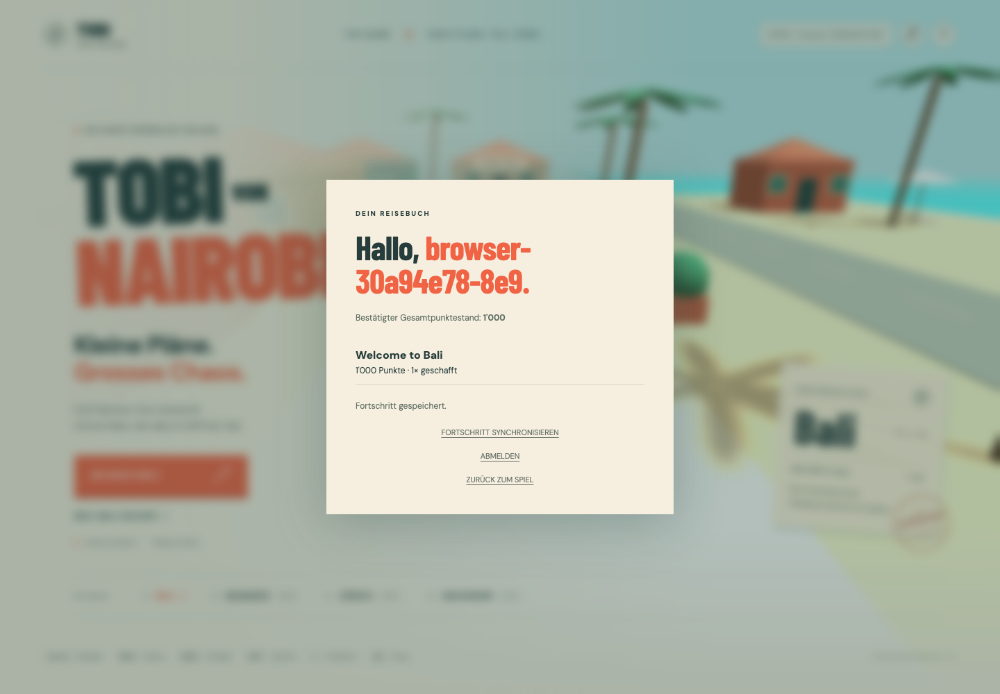

# Implementiert: Konten und Levelergebnisse

Dieser Vertrag beschreibt den Stand `feature/accounts-and-saves`. Das umfangreichere [Datenbank-/API-Zielmodell](data-and-api.md) bleibt Planung. Client und Server verwenden Zod-Schemas aus `packages/contracts/src/progress.ts`; Netzwerkantworten werden auch im API-Client validiert.

## Spielablauf

Vor dem Start über **ANMELDEN → NEUES KONTO ERSTELLEN** ein Konto anlegen. Tutorial, Beach Bar, Bali Night Market und Bali Escape sind verfügbar. Gastspiel funktioniert weiterhin; ein nachträglicher Login übernimmt den davor begonnenen Gastdurchlauf nicht.

Ein angemeldeter Start erzeugt einen serverseitigen Versuch. Nach dem Check-in schreibt der Client das Ergebnis zuerst in IndexedDB und sendet es danach an die API. Erst eine bestätigte Antwort entfernt den lokalen Eintrag. Geht die Antwort nach erfolgreichem Commit verloren, liefert dieselbe Anfrage erneut denselben Beleg, ohne Punkte oder Abschlüsse doppelt zu zählen. Die Kontoansicht lädt bestätigte Bestwerte aus PostgreSQL.

Beim normalen Neustart wird ein unvollendeter Versuch verworfen. Nach einem Browser-Reload bleibt ein angefangener Versuch sichtbar und kann im Konto explizit verworfen werden. Eine Wiederaufnahme der Position ist noch nicht implementiert. Ein noch nicht gesichertes Ergebnis blockiert den nächsten Durchlauf und kann erneut gespeichert werden.

## HTTP-Vertrag

Basis: `/api/v1`. JSON-Eingaben sind strikt; unbekannte Felder werden abgewiesen. Fehler verwenden HTTP-Status und eine Meldung. Alle Antworten tragen `Cache-Control: no-store`.

| Methode | Pfad                 | Verhalten                                                             |
| ------- | -------------------- | --------------------------------------------------------------------- |
| POST    | `/auth/register`     | `{username, password}`, Konto und Session anlegen, 201                |
| POST    | `/auth/login`        | Gleiche Eingabe, neue Session, 200                                    |
| GET     | `/auth/session`      | `{user, csrfToken}` oder beide `null`, 200                            |
| POST    | `/auth/logout`       | Session widerrufen, Cookie löschen, 204                               |
| GET     | `/progress`          | Saveslot, Revision, Gesamtpunkte, Bestwerte und aktiven Versuch lesen |
| POST    | `/runs`              | `{requestId: UUID, levelId}`, idempotenter Start, 201                 |
| POST    | `/runs/:id/complete` | `{pickupIds, elapsedMs, escapes, debugUsed}`, atomarer Abschluss, 200 |
| POST    | `/runs/:id/abandon`  | Eigenen aktiven Versuch verwerfen, Wiederholung erlaubt, 204          |

Alle Fortschritts-/Run-Endpunkte benötigen eine gültige Session. Alle POSTs benötigen den konfigurierten Origin und JSON; ausser Register/Login zusätzlich `X-CSRF-Token` aus der Sessionantwort. Typische Fehler: 400 ungültige Eingabe, 401 fehlende/abgelaufene Session, 403 Ursprung/CSRF, 404 fremder oder fehlender Versuch, 409 aktiver Versuch oder widersprüchliche Wiederholung, 422 unplausibles Ergebnis, 429 Rate Limit. Login-/Registrierungsnamen sind ohne Beachtung der Grossschreibung eindeutig.

`requestId` bleibt bei einem fehlgeschlagenen Start unverändert. Pro Saveslot erlaubt ein partieller Unique-Index nur einen aktiven Versuch. Ein zweiter Tab muss zunächst den bestehenden Versuch beenden oder verwerfen. Ergebnisse gehören immer zum ursprünglichen Konto; die lokale Warteschlange überträgt ausschliesslich Einträge der aktuell angemeldeten User-ID.

## Daten und Konsistenz

- `users`: Kontodaten und Passwort-Hash.
- `sessions`: SHA-256-Hash des zufälligen Tokens, Besitzer, Ablauf und letzte Aktivität.
- `save_games`: derzeit Slot 1, Gesamtpunkte, letzte World/Level und Revision.
- `game_runs`: Besitzer, Save, Anfrage-ID, Contentversion, Status, Ergebnis-Digest und Beleg.
- `level_progress`: Bestpunkte, Bestzeit und Zahl der Abschlüsse je Save/Level.

Migrationen `202609130002` und `202609130003` erweitern die Foundation ohne Reset vorhandener Daten. SQL-Constraints sichern Status, vollständige Abschlussbelege, positive Zeiten und den einzelnen aktiven Versuch ab. Bereits angewendete Migrationen bleiben unverändert.

Abschluss sperrt zuerst den eigenen Run, dann den Save. Levelprogress, Gesamtpunkte, Revision und Run-Beleg werden in derselben PostgreSQL-Transaktion geschrieben. Gleicher Ergebnis-Digest liefert den vorhandenen Beleg; ein abweichender liefert 409. Pickups werden zur Digestbildung sortiert. Start sperrt den Save; Verwerfen aktualisiert nur den Run.

Der Server akzeptiert keinen frei angegebenen Score. Er prüft eindeutige, vollständige Pickup-IDs, Contentversion, Zeituntergrenzen, Serverlaufzeit, Fluchtzahl und Debug-Markierung. Aktuelle Wertung: 100 pro Flasche, 500 Abschlussbonus, 500 pro gemeldeter plausibler Flucht. Tutorial: 1'000 Punkte; mit jeweils einer Flucht: Bali Escape 1'500, Beach Bar 2'000 und Bali Night Market 2'500 Punkte.

**Vertrauensgrenze:** Bewegungen und Ereignisse stammen vom Browser. Plausibilitätsprüfungen ersetzen keine autoritative Simulation; diese Punkte sind persönliche Kampagnenergebnisse und keine verifizierten öffentlichen Highscores. Wiederholte reguläre Durchläufe erhöhen die Gesamtpunkte, während Bestwerte separat geführt werden.

## Sessions und Schutz

Passwörter: 12–128 Zeichen, maximal 512 UTF-8-Bytes, Argon2id mit 19 MiB, zwei Iterationen und Parallelität 1. Maximal vier gleichzeitige Hashoperationen begrenzen die Last. Die Parameter folgen der [OWASP-Empfehlung für Argon2id](https://cheatsheetseries.owasp.org/cheatsheets/Password_Storage_Cheat_Sheet.html); Runtime und native Installation verwenden [node-argon2](https://github.com/ranisalt/node-argon2).

Das Sessiontoken enthält 32 zufällige Bytes. In Produktion setzt die API `__Host-tobi_session` mit Secure, HttpOnly, SameSite=Lax und Path `/`; lokal einen separaten Cookie-Namen ohne Secure. Absolute Lebensdauer sieben Tage, Inaktivitätsgrenze 24 Stunden. Login rotiert die präsentierte Session, Logout widerruft sie serverseitig. CSRF ist ein HMAC über das Token mit `SESSION_SECRET`; das CSRF-Token bleibt im Arbeitsspeicher. Passwörter und Sessiontokens werden nicht in IndexedDB gespeichert.

Auth ist auf zwölf Requests pro IP/Minute sowie 30 Versuche pro normalisiertem Benutzernamen/15 Minuten begrenzt; sonst 300 Requests pro IP/Minute. Queryparameter umgehen das Auth-Limit nicht. Diese Limiter gelten je API-Prozess. Mehrere Instanzen benötigen später einen gemeinsamen Limiter; Proxy-IP-Vertrauen muss vor Deployment explizit konfiguriert werden. Derzeit wird keine weitergeleitete IP blind vertraut.

Die Browser-API bleibt auf demselben Origin über Vite-/Reverse-Proxy. `CLIENT_URL` bezeichnet den erlaubten Browser-Origin, produktiv `https://tobi-von-nairobi.ch`; es gibt keine permissive CORS-Freigabe. `SESSION_SECRET` muss mindestens 32 Zeichen enthalten und wird durch das lokale Setup erzeugt. Produktion benötigt ein eigenes Secret und HTTPS.

## Wiederholung und bekannte Grenzen

Die IndexedDB-Warteschlange ist auf 50 Einträge begrenzt. Netzfehler werden mit 2–30 Sekunden Abstand erneut versucht; fachliche 4xx-Fehler halten automatische Wiederholungen an. Über **FORTSCHRITT SYNCHRONISIEREN** werden Session und Ergebnisse erneut geprüft. Löschen der Browserdaten entfernt noch nicht bestätigte lokale Ergebnisse. Ein Contentversionswechsel kann einen alten offenen Run ablehnen; kompatible Versionsmigrationen sind noch nicht vorhanden.

Noch offen: Checkpoint-Snapshots, Positionswiederherstellung, mehrere Slots, Passwortwiederherstellung/Kontolöschung, Achievements, Inventar, Save-Import und öffentliche Bestenlisten. Abgelaufene Sessions werden bei Authentifizierung für das Konto bereinigt; eine globale Aufbewahrungs-/Bereinigungsroutine für alte Sessions und Runs folgt vor dem produktiven Betrieb.

## Validierung

PostgreSQL-Integration prüft Passwort-/Token-Hashing, Loginrotation, Logout, Origin/CSRF, Ablauf, Isolation zwischen Konten, parallele Start-/Abschlusswiederholungen, unveränderten Fortschritt bei ungültigen Ergebnissen, Fluchtbonus, Rate Limits und Wiederherstellung nach API-Neustart. Der Browser spielt ein echtes Tutorial, verliert gezielt die Antwort nach dem Datenbank-Commit, lädt neu und prüft exakt einen Abschluss sowie erneuten Login. Ein Unit-Test verhindert, dass eine verspätete Sessionantwort den neuen Login-CSRF-Token überschreibt.

