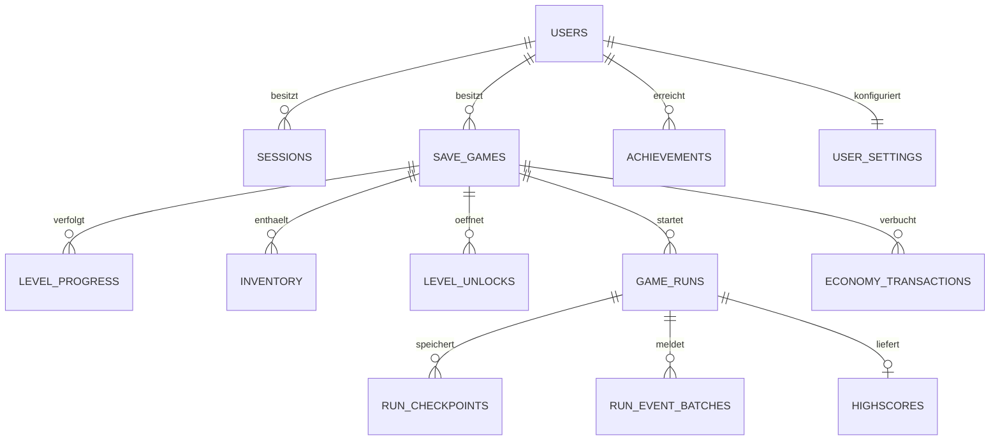

# Datenmodell, API und Speicherung

Status: Spezifikation, noch keine SQL-Migrationen oder Endpunkte. [Architektur](../../ARCHITECTURE.md) · [Gameplay](../../GAME_DESIGN.md)

## 1. Zustandsgrenzen und Autorität

| Kategorie                     | Beispiele                                                                                                                                             | Speicherung                                    |
| ----------------------------- | ----------------------------------------------------------------------------------------------------------------------------------------------------- | ---------------------------------------------- |
| flüchtige Runtime             | Position, Velocity, Stamina, Chaos, Wanted, Combo-Timer, aktive NPCs/Polizei, temporäre Effekte                                                       | nur in der laufenden Session                   |
| kompakter Wiederaufnahmepunkt | authored Checkpoint-ID, abgeschlossene Objectives, stabile gesammelte Pickup-IDs, notwendige Questflags, Run-Inventar, Score-/Zeitpräfix, RNG-Zustand | validierter, versionierter Checkpoint-Snapshot |
| dauerhaft                     | Unlocks, abgeschlossene Level, Bestwerte, Geld, permanentes Inventar, Achievements, Settings                                                          | normalisierte PostgreSQL-Entitäten             |

Ein Checkpoint serialisiert keine Babylon-Szene. Beim Wiederaufnehmen wird das Level aus seiner Content-Version neu erstellt, dann die logische Projektion angewendet. Tobi startet am authored sicheren Anker mit definierten Basiswerten; keine Rekonstruktion einer halben Polizeikollision. Verfolger, Effekte, Chaos und aktuelle Combo werden neu initialisiert. Checkpoints sind nur an dafür geeigneten Missionsgrenzen zulässig.

Der Server entscheidet über Accountbesitz, Käufe, Unlocks, Belohnungen, Revisionen und akzeptierte Scores. Der Client simuliert das lokale Spiel und liefert untrusted Beobachtungen. Für den Singleplayer-Fortschritt ist Plausibilitätsprüfung ausreichend; sie ist keine belastbare Anti-Cheat-Garantie.

## 2. Relationales Modell

IDs sind UUIDs, Zeiten `timestamptz` in UTC, Mengen und Spielgeld Ganzzahlen. Geld ist eine fiktive Währung ohne Echtgeldbezug. Pro Run bleibt Score unter einem expliziten sicheren Integer-Limit; Lifetime-Summen können in PostgreSQL `bigint` liegen und werden als Dezimalstring im API übertragen. `best_time_ms` verwendet aktive Spielzeit.

| Tabelle                | Wesentliche Spalten                                                                                                                                                                                                                   | Schlüssel und Regeln                                                                   |
| ---------------------- | ------------------------------------------------------------------------------------------------------------------------------------------------------------------------------------------------------------------------------------- | -------------------------------------------------------------------------------------- |
| `users`                | `id`, `username`, `username_normalized`, `password_hash`, `created_at`, `last_login`, `password_changed_at`                                                                                                                           | PK id; UNIQUE normalisierter Username; Hash niemals im DTO                             |
| `sessions`             | `id`, `user_id`, `token_hash`, `created_at`, `expires_at`, `last_seen_at`, `revoked_at`                                                                                                                                               | UNIQUE token_hash; FK user; Index Ablauf; nur Tokenhash in DB                          |
| `save_games`           | `id`, `user_id`, `slot`, `current_world_id`, `current_level_id`, `checkpoint_id`, `checkpoint_snapshot`, `snapshot_schema_version`, `content_version`, `money`, `lifetime_score`, `revision`, `created_at`, `updated_at`              | UNIQUE(user_id, slot); money ≥ 0; Revision monoton; Eigentümer in jeder Query          |
| `level_progress`       | `save_game_id`, `level_id`, `completed`, `best_score`, `best_time_ms`, `best_assisted_score`, `best_assisted_time_ms`, `bottles_collected`, `max_combo`, `max_wanted_level`, `completion_count`, `first_completed_at`                 | PK(save_game_id, level_id); Zeit NULL vor Abschluss; Werte ≥ 0; Wanted 0–5             |
| `inventory`            | `save_game_id`, `item_id`, `amount`, `updated_at`                                                                                                                                                                                     | PK(save_game_id, item_id); amount ≥ 0, typbezogene Limits im Service                   |
| `achievements`         | `user_id`, `achievement_id`, `unlocked_at`, `source_run_id`, `definition_version`                                                                                                                                                     | PK(user_id, achievement_id); accountweit einmalig                                      |
| `user_settings`        | `user_id`, `settings_schema_version`, `bindings`, `audio`, `video`, `accessibility`, `locale`, `revision`, `updated_at`                                                                                                               | PK/FK user; begrenzte, validierte JSONB-Sektionen                                      |
| `level_unlocks`        | `save_game_id`, `level_id`, `unlocked_at`, `source_run_id`                                                                                                                                                                            | PK(save_game_id, level_id)                                                             |
| `game_runs`            | `id`, `user_id`, `save_game_id`, `level_id`, `content_version`, `score_rules_version`, `seed`, `status`, `attempt_epoch`, `checkpoint_revision`, `started_at`, `finished_at`, `assisted`, `debug_used`, `result`, `validation_status` | ein aktiver Run pro Slot über partiellen Unique-Index; unveränderlicher Versionsbezug  |
| `run_checkpoints`      | `id`, `run_id`, `revision`, `attempt_epoch`, `checkpoint_id`, `snapshot`, `accepted_event_prefix`, `created_at`                                                                                                                       | UNIQUE(run_id, revision); begrenzte Retention, referenzierten aktuellen Punkt behalten |
| `run_event_batches`    | `run_id`, `attempt_epoch`, `sequence`, `digest`, `events`, `created_at`                                                                                                                                                               | PK(run_id, attempt_epoch, sequence); Payload-/Eventlimits                              |
| `highscores`           | `id`, `user_id`, `save_game_id`, `run_id`, `level_id`, `score`, `active_time_ms`, `content_version`, `score_rules_version`, `category`, `validation_status`, `created_at`                                                             | UNIQUE run_id; Index(level_id, rules, category, score DESC, time ASC, id)              |
| `economy_transactions` | `id`, `save_game_id`, `source_key`, `kind`, `money_delta`, `item_changes`, `created_at`                                                                                                                                               | UNIQUE(save_game_id, source_key); auditierbare einmalige Rewards/Käufe                 |
| `user_collectibles`    | `user_id`, `collectible_id`, `collected_at`, `source_run_id`                                                                                                                                                                          | PK(user_id, collectible_id); z. B. Abu-Dhabi-Dialoge                                   |
| `idempotency_keys`     | `user_id`, `scope`, `key`, `request_hash`, `response_status`, `response_body`, `expires_at`                                                                                                                                           | UNIQUE(user_id, scope, key); TTL erst nach vereinbartem Retry-Fenster                  |
| `content_releases`     | `version`, `manifest_hash`, `status`, `published_at`                                                                                                                                                                                  | immutable Release-ID; FK-Ziel für Contentversionen                                     |

World-/Level-/Item-/Achievement-Definitionen bleiben versionierte Game Data, nicht parallel editierbare DB-Inhalte. Der Server validiert IDs gegen das zum Run gehörende Manifest. Historische Inhalte bleiben für Wiederaufnahme verfügbar; `content_releases` verfolgt deren Lifecycle. SQL-FKs gelten für relationale Besitzer und Runs; die Referenzintegrität zu Content-IDs erzwingen Release-Validator und API.

Die ursprünglichen userbasierten Tabellen `level_progress` und `inventory` werden bewusst einem Spielslot zugeordnet. Sonst würden zwei Spielstände Bestände und Fortschritt vermischen. Achievements, Settings und gefundene Dialoge sind accountweit. `bottles_collected` in level_progress bezeichnet das beste einzelne Run-Sammelergebnis, keinen unklaren Lifetime-Zähler; globale Statistiken werden aus akzeptierten Ergebnissen bzw. expliziten Aggregaten gebildet.

`save_games.checkpoint_snapshot` ist die aktuelle Wiederaufnahmeprojektion; `run_checkpoints` bewahrt deren begrenzte Historie. Beide werden in derselben Transaktion aktualisiert. `level_progress.best_score` und reguläre Zeitwerte berücksichtigen nur abgeschlossene, nicht assistierte und nicht debugmarkierte Runs; Assist-Werte stehen separat. Fortschrittsfreischaltung ist auch mit Checkpoint-Hilfe möglich.

## 3. Migrationen und Datenintegrität

Prisma-Schema, generierter Client und Migrationen haben einen gemeinsamen Besitzer unter `packages/database/`. Durch Prisma nicht ausdrückbare Constraints oder partielle Indizes werden als überprüfte SQL-Migrationen ergänzt. Kein zweiter Migrationsordner im Repository-Root. Angewendete Migrationen werden nicht geändert; neue Migrationen entwickeln das Schema weiter.

Referenzen auf User/Save verhindern fremde Zuordnung. Für Beziehungen mit gleichzeitigem `user_id` und `save_game_id` prüft der Service deren Konsistenz, unterstützt durch zusammengesetzte Constraints, wo sinnvoll. Löschen eines Accounts entfernt private abhängige Daten und anonymisiert/entfernt öffentliche Einträge gemäss festgelegter Produktregel; Betrieb und Backups dokumentieren die Löschfristen.

Prisma-Transaktionen dienen atomaren Updates, nicht dem Halten langer Netzwerkarbeit innerhalb der DB. Konflikte werden mit Revisionen bzw. kurzen Row Locks und begrenztem Retry behandelt. Das Transaktionsdesign folgt dem offiziellen Ansatz zu [Prisma-Transaktionen](https://docs.prisma.io/docs/orm/v7/prisma-client/queries/transactions); die verlinkte Dokumentationsversion ist eine technische Referenz, keine bereits installierte Projektversion. Konkrete Isolation und SQL werden bei Implementierung am PostgreSQL-Integrationstest nachgewiesen.

## 4. API-Konventionen

REST unter `/api/v1`, JSON mit camelCase, Zeitstempel ISO-8601. Geteilte Schemas erzeugen TS-Typen und die OpenAPI-Spezifikation. API-Client und Server verwenden dieselben DTOs; keine Prisma-Modelle im Browser. Datum/Bigint werden vor dem Transport explizit konvertiert.

Fehlerformat: `error.code`, `message`, optionale feldbezogene `details`, `requestId`. Statuscodes: 400 ungültige Form, 401 fehlende Session, 403 gesperrte Aktion, 404 nicht gefunden oder fremde Ressource, 409 Revision-/Run-/Idempotenzkonflikt, 422 fachlich ungültiger Inhalt, 429 Rate-Limit mit Retry-Hinweis. Pagination ist cursorbasiert mit begrenztem `limit`, maximal 50 im MVP.

Mutationen mit Wiederholungsrisiko verwenden `Idempotency-Key`. Gleicher Key + gleicher Request liefert dasselbe Ergebnis; gleicher Key + anderer Hash ergibt 409. Revision wird mit `If-Match` übertragen; Responses liefern einen ETag. Idempotenz wird vor dem Abweisen einer nach erfolgreicher Mutation veralteten Revision geprüft, damit verlorene Antworten sauber wiederholt werden können.

| Methode / Pfad                           | Zweck und wesentliche Daten                                                      |
| ---------------------------------------- | -------------------------------------------------------------------------------- |
| `POST /auth/register`                    | Username/Passwort validieren, Account und Basissettings erstellen                |
| `POST /auth/login`                       | sichere Session erzeugen, Cookie setzen, öffentliche Userdaten liefern           |
| `POST /auth/logout`                      | Session widerrufen, Cookie entfernen                                             |
| `GET /auth/session`                      | aktuellen User, Sessionstatus und CSRF-Token liefern                             |
| `GET /users/me`                          | Accountprofil ohne geheime Felder                                                |
| `GET /content/manifest`                  | aktive unterstützte Content-/Schema-/Scoreversionen                              |
| `GET /save-games`                        | eigene Slots und Übersicht                                                       |
| `POST /save-games`                       | Kampagnen-Slot mit initialen Unlocks erzeugen                                    |
| `GET /save-games/:saveId`                | bestätigte Projektion, Revision, Fortschritt und aktiver Run                     |
| `POST /save-games/:saveId/runs`          | freigeschaltetes Level starten; Server erzeugt Run-ID, Seed, Version und Loadout |
| `POST /runs/:runId/events`               | begrenzten Eventbatch mit Epoche/Sequenz annehmen und deduplizieren              |
| `POST /runs/:runId/checkpoints`          | authored Checkpoint, Eventpräfix und kompakte Projektion prüfen und speichern    |
| `POST /runs/:runId/resume`               | aktuelle bestätigte Checkpointrevision fortsetzen; neue Versuchsepoche           |
| `POST /runs/:runId/complete`             | Endereignisse, Statistiken und Pflichtziele prüfen; Belohnungen atomar anwenden  |
| `POST /runs/:runId/abandon`              | Run beenden; zuvor abgebuchtes Loadout bleibt verbraucht                         |
| `GET /save-games/:saveId/level-progress` | Bestwerte und abgeschlossene Level                                               |
| `GET /save-games/:saveId/inventory`      | dauerhafte Bestände                                                              |
| `POST /save-games/:saveId/purchases`     | Item-ID/Menge/Shop-ID; Preis und Berechtigung vom Server                         |
| `GET /users/me/achievements`             | accountweite Freischaltungen und zulässiger Fortschritt                          |
| `GET /highscores?levelId=…&category=…`   | versionierte, paginierte Einträge                                                |
| `GET /users/me/settings`                 | UI-/Input-/Audioeinstellungen                                                    |
| `PATCH /users/me/settings`               | validierte Teiländerung, eigene Settings-Revision                                |
| `GET /health/live`, `GET /health/ready`  | Prozess bzw. DB-/Migrationsbereitschaft; keine Secrets                           |

Es gibt keinen freien `PUT saveGame` mit beliebigem Geld, Score oder `completed=true`. Unlocks und Fortschritt entstehen aus Anwendungsfällen. Achievement-Events können über kleine Eventbatches früh synchronisiert werden; der Server wertet Definition und Quelle aus. Käufe ausserhalb des Hubs benötigen eine aktive, zulässige Shopinteraktion. Passwortänderung mit aktueller Authentifizierung und Accountlöschung folgen vor öffentlichem Betrieb; ein Recovery-Flow wird bei Ergänzung eines verifizierten Kontaktkanals konkretisiert. Das MVP setzt keinen nicht spezifizierten E-Mail-Dienst voraus.

## 5. Ein Run, ein atomarer Abschluss

1. Client fordert Run für eigenen Slot und freigeschaltetes Level an. Der Server bindet Content-/Scoreversion und Seed, reserviert den aktiven Slot und bucht optionales permanentes Loadout einmal ab.
2. Die lokale Simulation erstellt begrenzte Ereignisbelege. Server akzeptiert Batches in Sequenz; doppelte Batches sind unschädlich, Lücken oder widersprüchliche Digests werden zurückgewiesen.
3. Checkpoint/Ergebnis referenzieren den angenommenen Eventpräfix. Der Server prüft Pickup-IDs/Mengen, Objectives, Reihenfolge, erlaubte Effekte, Zeitgrenzen und Score-Caps mit geteilten Regeln.
4. `complete` prüft Sessionbesitz, Runstatus, Versuchsepoche und erwartete Save-Revision. Innerhalb einer DB-Transaktion: Resultat fixieren, Score berechnen, Bestwerte aktualisieren, Geld/Rewards einmal verbuchen, Achievements/Collectibles upserten, Unlocks anlegen, Save-Position aktualisieren, Run abschliessen, Idempotenzresponse speichern und Revision erhöhen.
5. Erst nach Commit bestätigt die API den Abschluss. Ein verlorenes Responsepaket wird mit demselben Key erneut angefordert. UNIQUE auf Runergebnis und Reward-Quellen verhindert Duplikate auch nach Ablauf des Idempotenz-Caches.

Ein Backendprozess-Absturz zwischen Teiloperationen führt zum Rollback. Bei zwei gleichzeitigen Abschlussanfragen gewinnt eine Transaktion, die zweite erhält denselben bestätigten Abschluss oder einen definierten Konflikt. `max` für Bestscore und `min` für beste abgeschlossene Zeit werden transaktionssicher berechnet, niemals aus einem vorher ungeschützt gelesenen Snapshot.

## 6. Autosave, Offlineverhalten und Wiederaufnahme

Autosave-Trigger: Levelabschluss, authored Checkpoint, Achievement, wichtige Freischaltung und Worldwechsel. Abschluss/Worldwechsel/Unlocks sind gemeinsam atomar. Ein Achievement kann einen kleinen Eventbatch und die eigene einmalige Freischaltung speichern, ohne einen unsicheren räumlichen Checkpoint zu erzeugen.

`SaveCoordinator` legt Mutationen zuerst in einer begrenzten IndexedDB-Outbox ab, nach `userId/saveId/runId/attemptEpoch` getrennt. Netzwerk läuft asynchron. Kurz aufeinanderfolgende ersetzbare Checkpoints können zusammengefasst werden; nicht ersetzbare Abschluss-/Rewardbefehle bleiben erhalten. Retry mit exponentiellem Backoff und Jitter, beispielsweise 1/2/4/8 bis 30 s. 401 pausiert Synchronisation bis erneuter Anmeldung; 409 erfordert Laden der Serverrevision statt blindem Überschreiben.

HUD-Status: „Speichert …“, „Gespeichert“, „Lokal vorgemerkt – Synchronisation ausstehend“, „Speicherkonflikt“. Ein lokal abgeschlossener Run darf seine Ergebnisansicht zeigen; dauerhafte neue Level werden erst nach Serverbestätigung freigegeben. Kein blockierender HTTP-Aufruf im Spieltick und keine Behauptung, ein nicht bestätigter Save liege bereits in PostgreSQL.

Ein begonnener Run kann bei Netzverlust lokal zu Ende gespielt werden. Neue Accounts und neue autorisierte Runs benötigen im MVP Netzwerk. Beim Reload werden zunächst bestätigter Save und Outbox geprüft: ein bereits lokales Abschlussgesuch wird synchronisiert, bevor eine Wiederaufnahme gestartet wird. Keine Garantie für Rettung nach gelöschtem Browserstorage; bestätigte Checkpoints bleiben erhalten. Unload-/Beacon-Speichern ist nur eine zusätzliche Chance, nie Grundlage der Zuverlässigkeit.

**Checkpoint-Retry-Protokoll:** `resume` übernimmt ausschliesslich die zuletzt serverbestätigte Checkpointrevision und erhöht `attempt_epoch`. Alle noch offenen Events des alten Versuchs nach diesem Präfix werden superseded. Der neue Versuch übernimmt logische Mission, gesammelte IDs, Run-Bestände und Score-/Zeitpräfix des Checkpoints; Stern-/Combo-/Effektzustände starten definiert neu. Requests einer alten Epoche werden verworfen. Der Run wird `assisted`, sodass Zurücksetzen keine regulären Zeitrekorde erzeugt.

Eine schon dauerhaft freigeschaltete accountweite Auszeichnung bleibt nach Retry bestehen; ihre eindeutige ID verhindert doppelte Rewards. Run-Score nach dem Checkpoint wird verworfen. Die Wiederherstellung desselben Run-Inventars überträgt keine Items zurück auf das Account und verdoppelt keine permanente Entnahme. Ein neuer vollständiger Run benötigt eine neue Autorisierung/Loadoutbuchung.

**Mehrere Tabs/Geräte:** ein aktiver Run pro Slot. BroadcastChannel kann lokal warnen, die Garantie liegt aber im DB-Constraint und den Revisionen. Ein zweites Gerät darf bestätigten Fortschritt lesen; Übernahme erfolgt explizit über Resume und invalidiert die alte Epoche. Kein Last-Write-Wins für Inventar oder Geld. Settings besitzen eine eigene Revision, damit Lautstärkeänderungen nicht den Runabschluss blockieren.

**Save-Migration:** Content-Version und Snapshot-Schemaversion werden getrennt geführt. Loader migrieren bekannte alte Projektionen über getestete reine Schritte. Umbenannte IDs bekommen explizite Alias-/Migrationsdaten. Ist ein Checkpoint mit einem neuen Contentrelease nicht nutzbar, wird die alte Version angeboten oder ein definierter Levelstart mit erhaltenem bestätigtem Dauerfortschritt gewählt; nie stillschweigend löschen. Mindestens aktuelle und vorherige freigegebene Version bleiben während eines angekündigten Migrationsfensters verfügbar.

## 7. Score-Validierung und ihre Grenze

Der Server berechnet die Formel selbst und prüft Menge, Einmaligkeit und Existenz von Pickups, erreichbare Maxima, Objective-Reihenfolge, Runstatus, Zeitrelationen, Effektdauern und Versionsbindung. Er akzeptiert keinen fertigen beliebigen Clientscore. Ausgewählte Events können gleich mit Achievements/Checkpoints gesendet werden, keine Übertragung jeder Position.

Ein modifizierter Browser kann dennoch eine plausible Ereignisfolge erfinden. Signierte Run-IDs, Seeds und HTTPS ändern das nicht. MVP-Highscores tragen daher `validation_status=plausible_client_report` und eine sichtbare Community-Kategorie, keine Behauptung „cheatsicher“. Debug-/Assist-/Offline-Runs werden gesondert geführt oder ausgeschlossen. Persönlicher Fortschritt bleibt der Fokus.

Ein späterer kompetitiver Modus benötigt einen eigenen Entwurf: serverautoritatives Gameplay oder nachprüfbare Simulation mit klaren Determinismusanforderungen und Betriebsbudget. Das ist kein versteckter Bestandteil dieses MVP.

## 8. Security und Betrieb

Passwörter werden mit Argon2id und individuellem Salt gehasht. Parameter werden auf dem API-Zielsystem kalibriert und mindestens anhand der aktuellen [OWASP-Empfehlung zur Passwortspeicherung](https://cheatsheetseries.owasp.org/cheatsheets/Password_Storage_Cheat_Sheet.html) gewählt. Lange Passphrasen sind erlaubt; eine dokumentierte maximale Bytelänge begrenzt Hashing-DoS. Keine Passwörter, Sessiontokens oder vollständigen Authpayloads in Logs.

Sessions verwenden kryptografisch zufällige opake Tokens, serverseitig gespeichert als Hash. Produktionscookie: `__Host-tobi_session`, `HttpOnly`, `Secure`, `SameSite=Lax`, `Path=/`, kein Domain-Attribut. Rotation bei Login/Passwortwechsel, Widerruf bei Logout, serverseitige Idle- und Absolutabläufe; Ausgangspolitik 24 h idle/7 Tage absolut. Lokales HTTP erhält ausdrücklich getrennte Cookiekonfiguration. Hintergrundspielping verlängert keine Session beliebig. Diese Regeln orientieren sich an [OWASP Session Management](https://cheatsheetseries.owasp.org/cheatsheets/Session_Management_Cheat_Sheet.html).

Produktion nutzt nach Möglichkeit denselben Origin für Client und `/api`. Zustandsänderungen prüfen Origin und ein an die Session gebundenes CSRF-Token; SameSite allein ist nicht die einzige Kontrolle. Login/Registrierung akzeptieren nur erwarteten Origin und JSON. CORS ist standardmässig aus bzw. auf konkrete erlaubte Origins begrenzt; niemals Credentials zusammen mit `*`.

Alle DTOs und gespeicherten JSON-Snapshots werden zur Laufzeit auf Form, Grösse und Werte geprüft. Richtwerte: normale Requests 64 KiB, Checkpoints/Eventbatches maximal 256 KiB; Batch maximal 500 Ereignisse, Run insgesamt begrenzt. Unerwartete Felder ablehnen. Jeder Objektzugriff prüft Besitz serverseitig. Prisma nutzt parametrisierte Abfragen; Raw SQL nur mit Parametern, nie mit unescaped Nutzereingabe. Contentcommands kommen aus einer Allowlist, Dialogtext wird escaped angezeigt.

Rate Limits unterscheiden Login/Registrierung, Reads, Eventbatches und Mutationen; Username- und IP-Limits gegen Brute Force, generische Loginfehler, begrenzte parallele Hashoperationen. Bei mehreren API-Instanzen muss der Limiter einen gemeinsamen Store oder einen zentralen Proxy nutzen. Client-IPs werden nur aus explizit vertrauten Proxyheaders gelesen.

TLS, Securityheaders und eine getestete CSP begrenzen Skript-/Assetquellen. Havok/Decoder-WASM sowie Worker werden selbst gehostet; erforderliche CSP-Ausnahmen sind eng und in Browsertests geprüft. Kein allgemeines `unsafe-eval` aus Bequemlichkeit. Secrets stammen aus Deployment-Secrets, der Browser erhält nur öffentliche Konfiguration. Abhängigkeiten und Container werden versioniert und auf bekannte Probleme geprüft.

Backend-Logs sind strukturiert (`info`, `warn`, `error`, `debug`) mit Request-/Run-ID, Dauer und Fehlercode; sensible Felder werden redigiert. Metriken: Fehlerrate, p95-Latenz, DB-Pool, Savekonflikte, abgelehnte Runs, Outbox-Retryfehler. Vor öffentlichem MVP: automatisierte DB-Backups, Restore-Probe, dokumentierte Aufbewahrung, kontrollierte Migration und nachvollziehbare Releaseversionen. Kein Runtimezustand und kein Geräte-Fingerprinting in Standardlogs.
