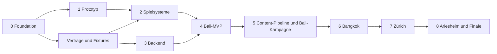

# Milestones, MVP und erste Git-Commits

[Projektplan](../../IMPLEMENTATION_PLAN.md) · [Repository](repository-and-workflow.md)

## 1. Reihenfolge und Kapazität

Die Phasen folgen dem gewünschten Ablauf 0–8. Phase 3 kann nach Stabilisierung der Verträge parallel zu Phase 2 laufen; die Backendabnahme bleibt Voraussetzung für Phase 4. Art-/Levelarbeit beginnt früh mit kleinen Proben, nicht mit der Produktion aller Worlds.

Für fünf erfahrene, überwiegend verfügbare Entwickler und wiederverwendbare/provisorische Assets sind **etwa 10–16 Kalenderwochen bis zu einem belastbaren Bali-MVP** eine erste Schätzung inklusive Integration und Playtestschleifen. Das entspricht grob 50–80 Personenwochen; fünf reine Programmierer ersetzen die benötigte Animation-/Art-/Audioarbeit nicht. Ohne diese Kapazität dauert Content länger. Die Schätzung wird nach Phase 1 anhand gemessener Geschwindigkeit erneuert. Für die gesamte Kampagne ist vor der Content-Pipeline kein seriöses fixes Datum ableitbar.

## 2. Phasen mit messbarer Abnahme

| Phase                   | Lieferung / Schwerpunkt                                                                                                                   | Voraussetzung                                           | Abnahmekriterium                                                                                                                                            |
| ----------------------- | ----------------------------------------------------------------------------------------------------------------------------------------- | ------------------------------------------------------- | ----------------------------------------------------------------------------------------------------------------------------------------------------------- |
| 0 Repository Foundation | Git-/PR-Basis, pnpm, TS strict, ESLint/Prettier/EditorConfig, CI, Compose-PostgreSQL, Env-Setup, Packages und ADRs                        | dieser Plan als Arbeitsgrundlage                        | neuer Entwickler kann Setup nachvollziehen; zwei minimale Apps bauen; PR-Gates/Reviewpflicht am Remote nachgewiesen; keine Secrets im Repo                  |
| 1 Technical Prototype   | Testmap, Placeholder Tobi, Actions, GameHost/Loop, Third-Person-Kamera, Kapselbewegung, Sprung, Kollision, Flaschenpickup, F1-Basis       | Foundation und minimale Contracts                       | 10-minütige Testarena ohne Durchfallen/Steckenbleiben; Treppen/Ecken/Highspeed geprüft; Pause/Fokusverlust und Dispose funktionieren; erste Referenzmessung |
| 2 Core Gameplay         | Stamina, Inventory, Items/Effektframework, Chaos/Wanted, Police-FSM/Director, Missionhandler, Combo/Score, vereinfachte zivile Reaktionen | Controller/Clock/Events stabil                          | Flucht über zwei Routen mit klarer Entdeckung/Countdown; deterministische Regeltests; neue Mission als Daten; keine doppelte Pickupwertung                  |
| 3 Backend               | Benutzer/Login/Sessions, PostgreSQL/Prisma, Save/Run-API, Fortschritt, Achievement/Highscore/Settings, Outbox-Protokoll                   | gemeinsame Schemas; läuft teilweise parallel zu Phase 2 | Eigentümerprüfung, CSRF, konkurrierender Abschluss, verlorene Antwort, Snapshotmigration und PostgreSQL-Restore geprüft                                     |
| 4 MVP Bali              | `bali_mvp_escape`, HUD/Pause/Ergebnis, ein Bonus, Secret, Easter Egg, vollständige Speicherung                                            | Phasen 2 und 3 integriert                               | alle 14 MVP-Schritte bestehen; Reload aus PostgreSQL; neue Spieler verstehen Loop; Browser-/Performance-Abnahme dokumentiert                                |
| 5 Content Pipeline      | Levelgenerator/Validator, GLB-Optimierung/Manifest, Nav-/Colliderdaten, Playtestprozess; vollständige Bali-Levels 1–4                     | unterhaltsames MVP                                      | zweites Level ohne Engineänderung; Tutorial garantiert ohne Polizei; Scooter-Grundfunktion für Bali 3; Bali 4 höchstens ★★★                                 |
| 6 Bangkok               | Levels 5–8, Tuk-Tuk/Fahrzeugwechsel, Fahrspurverkehr, dichte Gassen, zusätzliche AI-Aufträge                                              | reproduzierbare Pipeline, stabiler Scooter              | vier neue Level mit Replay-Vertrag; erste ★★★★-Sperren fair; kein Pflichtziel durch Verkehrsblockade unerreichbar                                           |
| 7 Zürich                | Levels 9–12, Crowd-Profile, Shop, Dialog/Zugang, Security-Weste, Nebel-/Sichtzonen                                                        | Bangkok und stabile Missionhandler                      | mindestens zwei Lösungen der VIP-Mission; Shop atomar; hohe NPC-Dichte im Budget; Rauchzeichen bleibt lesbar                                                |
| 8 Arlesheim             | Levels 13–16, Hub/Outfits/Statistiken, Schnitzeljagd, Karl-Regie, kompletter Finale-Loop                                                  | alle benötigten Mechaniken und Contentflags             | Kampagne vom neuen Account bis Victory spielbar; ★★★★★ überlebbar; sämtliche Achievements erreichbar; Saves über Releases wiederherstellbar                 |

**Orientierung für MVP-Aufteilung:** Phase 0 etwa 1–2 Wochen, Phase 1 etwa 2–3, Phase 2 etwa 3–4, Phase 3 etwa 2–4 teilweise parallel, Phase 4 etwa 2–3 plus gemeinsame Integrationsreserve. Die Gesamtschätzung ist wegen Überschneidungen keine Summe dieser Spannen. Technische Gates und Spielgefühl entscheiden über den Phasenwechsel.

Die vier Bali-Kampagnenlevels werden ausdrücklich in Phase 5 vervollständigt. Die Vorgabe „Scooter in Bali“ braucht deshalb bereits dort einen begrenzten Fahrzeug-Spike; Phase 6 erweitert ihn um Tuk-Tuk, Wechsel und dichteren Verkehr. Fahrzeuge werden so nicht versehentlich bis Bangkok verschoben.

## 3. MVP-Umfang

Im MVP: Desktop, ein Account/ein Kampagnen-Slot, eine kleine Bali-Arena, Placeholder oder erste stilisierte Tobi-Figur, zentrale Bewegung/Animation, normale/seltene Flaschen, Werfen, Speed/Energy, Stamina, Chaos/Wanted bis drei Sterne, grundlegende Police-FSM, datengetriebene Mission, Combo/Score, HUD/Pause/Ergebnis, Checkpoint-/Abschlussspeicherung, Achievements „Erste Runde“ und Fluchtgrundlagen.

Später: 16 Kampagnenlevels, Scooter/Tuk-Tuk/Taxi, Focus/Iron/Mystery-Ausbau, Security-Weste, komplexe Dialoge/Shops, Karl-Rettungsregie, komplettes Achievementset, Gamepad/Mobile, mehrere sichtbare Saveslots, optional WebGPU und kompetitive Ranglisten. Daten-/Portverträge berücksichtigen diese Erweiterungen, aber MVP-Implementierung baut keine leeren Grosssysteme dafür.

## 4. Verbindlicher MVP-Abnahmelauf

| Schritt                         | Beobachtbares Ergebnis                                                  | Nachweis                                 |
| ------------------------------- | ----------------------------------------------------------------------- | ---------------------------------------- |
| 1 Account erstellen             | eindeutiger Username, Passwort gehasht, verständliche Fehler            | API-/Authintegration + E2E               |
| 2 Spiel starten                 | eigener Slot/Run angelegt, Bali geladen                                 | UI und DB-Run                            |
| 3 Third Person steuern          | WASD/Pfeile, Maus, Sprint, Sprung, Kollision                            | echte Browsereingaben und manuelle Arena |
| 4 fünf Flaschen sammeln         | 5 eindeutige Pickups zählen einmal                                      | HUD, Missionzustand, Eventprüfung        |
| 5 Chaos erzeugen                | Sammeln plus Alarm erhöhen sichtbar Chaos                               | Regeln + HUD                             |
| 6 Polizei aktivieren            | nachvollziehbare Ankunft, Identifikation, mindestens ★★                 | Szene und AI-State                       |
| 7 fliehen                       | Sprint/Stamina und beide Routen nutzbar                                 | Playtest                                 |
| 8 abhängen                      | Sichtverlust startet 12 s; Entdeckung setzt zurück; Escape genau einmal | Director-Test + E2E                      |
| 9 Airbnb erreichen              | Ziel wird erst nach Escape freigegeben                                  | Mission-/Zonentest                       |
| 10 Score erhalten               | nachvollziehbare Komponenten und Endscore                               | Golden-Result-Test + Ergebnisansicht     |
| 11 Level abschliessen           | Pflichtgraph fertig, Ergebniszustand stabil                             | E2E                                      |
| 12 PostgreSQL speichern         | Run, Progress, Reward, Achievement und Revision konsistent              | DB-Abfrage im Integrationstest           |
| 13 Browser neu laden            | UI bootet ohne alten In-Memory-State                                    | neue Browserseite/Context                |
| 14 Fortschritt wiederherstellen | Server liefert bestätigten Levelabschluss, Geld und Bestwerte           | E2E mit echter API/DB                    |

Zusätzliche Freigabegates: verlorene Completionantwort erzeugt keine doppelten Rewards; fremder Account kann Save nicht lesen/ändern; Retry am Checkpoint erhält logischen Fortschritt; Pause/Tabverlust ist sicher; zweiter Tab kann alten Zustand nicht überschreiben; 5–15 Minuten Erstlauf; beide Fluchtrouten brauchbar; Referenzgeräte erreichen das vereinbarte Profil.

Der E2E-Lauf darf die schwierigen Gameplay-Schritte nicht durch Debug-Komplettierung ersetzen. Für Debugtools gibt es einen separaten Test. Die MVP-Anzeige benennt den Testlevel klar und behauptet nicht, die gesamte Bali-Kampagne sei bereits verfügbar.

## 5. Konkrete Reihenfolge der ersten Commits

Die folgende Liste beschreibt die geplante logische Reihenfolge kleiner Commits/PRs. Der initiale technische Prototyp bündelt bereits Teile dieser Schritte; die tatsächliche Historie steht im GitHub-Repository. Jeder Schritt ist baubar bzw. als Dokumentations-/Vertragsänderung selbstständig reviewbar. Parallele Teams können nach den gemeinsamen Contracts unabhängig abzweigen; die Liste gibt die sichere Integrationsreihenfolge vor.

| Nr. | Conventional Commit                                               | Konkretes Ergebnis                                                            |
| --- | ----------------------------------------------------------------- | ----------------------------------------------------------------------------- |
| 1   | `docs(plan): define game design and implementation roadmap`       | diese Planung als Ausgangsstand                                               |
| 2   | `chore(repo): initialize pnpm monorepo`                           | Workspace, minimale Packages, Ignore-/LFS-Konvention, Toolchainpin            |
| 3   | `chore(tooling): configure typescript eslint and prettier`        | strict, Format, EditorConfig, Importregeln, gemeinsame Scripts                |
| 4   | `chore(ci): add pull request quality gates`                       | CI, PR-Template, CODEOWNERS; Remote-Ruleset separat eingerichtet/nachgewiesen |
| 5   | `chore(dev): add postgres compose and environment setup`          | Compose/Healthcheck, Envbeispiele, nicht destruktives Setup                   |
| 6   | `feat(contracts): define game events and api schemas`             | Actions, IDs, Level/Objective-/Run-/Saveverträge, Beispieldaten               |
| 7   | `feat(server): create modular nest application`                   | Fastify-Adapter, Konfiguration, Logging, Health; noch keine vollständige Auth |
| 8   | `feat(client): create react and babylon application shell`        | Canvas/GameHost, Menü, Lazy Engine-Boot, Error Screen                         |
| 9   | `feat(game): add fixed step session lifecycle`                    | Clock, Eventphasen, Pause/Dispose, Testadapter                                |
| 10  | `feat(input): add action based keyboard and mouse controls`       | Bindings, Kontexte, Pointer Lock, Fokusverlust                                |
| 11  | `feat(physics): add havok character motor adapter`                | Kapsel, Kollisionslayer, Testarena/Queries                                    |
| 12  | `feat(player): implement third person movement and stamina`       | Bewegung, Sprint, Jump, Grounding und Basistests                              |
| 13  | `feat(camera): add collision aware third person camera`           | Follow, Orbit, Hinderniskorrektur, Kameraoptionen                             |
| 14  | `feat(devtools): add runtime inspection menu`                     | F1, Teleport, FPS, Collider, sticky Debugmarkierung                           |
| 15  | `feat(inventory): add run inventory and item contracts`           | Mengen, Auswahl, Quest-Pouch, atomarer Verbrauch                              |
| 16  | `feat(items): implement bottle pickups throws and basic powerups` | stabile Pickup-IDs, Flaschen, Speed/Energy, Geräusche                         |
| 17  | `feat(chaos): implement data driven chaos rules`                  | Ursachen, Abbau, Bänder/Hysterese                                             |
| 18  | `feat(wanted): add pursuit escalation and level caps`             | bestätigte Vorfälle, Sterne, Einsatzbudgetvertrag                             |
| 19  | `feat(police): implement perception patrol chase and search`      | modulare FSM, Navigationadapter, Director, Escape-Timer                       |
| 20  | `feat(missions): implement objective handler framework`           | Graph, Collect/Reach/Escape, Validation, Snapshots                            |
| 21  | `feat(score): add combo and versioned scoring rules`              | Formeln, Deduplizierung, Begrenzungen, Result-Fixtures                        |
| 22  | `feat(database): add account savegame and run schema`             | Prisma, Constraints, Migrationen, Seeds, Transaktionstests                    |
| 23  | `feat(auth): add account registration and secure sessions`        | Hashing, Login, Cookie, CSRF, Ownership, Rate Limits                          |
| 24  | `feat(api): add idempotent run and savegame endpoints`            | Checkpoints, Completion, Progress, Rewards, Konflikttests                     |
| 25  | `feat(client): add save synchronization and recovery`             | API-Client, Outbox, Status, Retry/Resume                                      |
| 26  | `feat(level): create data driven bali mvp escape`                 | Alarmgraph, 5 Flaschen, zwei Routen, Safe Zone, Bonus/Secret                  |
| 27  | `feat(ui): add game hud pause and level results`                  | zentrale Anzeigen, Controls, Speicherrückmeldung, Accessibility               |
| 28  | `test(e2e): cover bali completion and persisted reload`           | kompletter Nutzerdurchlauf gegen PostgreSQL                                   |
| 29  | `perf(bali): meet initial browser performance budgets`            | Messbericht und gezielte Optimierungen, falls nötig                           |
| 30  | `docs(mvp): record acceptance and content production guide`       | tatsächliche Abnahme, bekannte Grenzen und nächster Contentbrief              |

Die Backendcommits 22–24 können nach 6/7 parallel zu 9–21 entwickelt und früher integriert werden. Der HUD-Bereich beginnt ebenfalls mit Fixtures nach 6; Commit 27 beschreibt die vollständige integrierte Ansicht. So warten fünf Entwickler nicht auf einen einzelnen linearen Bearbeiter. Tests begleiten jedes Feature; Commit 28 ergänzt den übergreifenden Nutzernachweis und verschiebt nicht sämtliche Tests ans Ende.

## 6. Phase-0-Backlog für den unmittelbaren Start

Erste Arbeitspakete: Git-/Remote-Bootstrap und Dokumente einordnen; Toolchain prüfen und fixieren; Workspace/Appskelette erstellen; Qualitätsscripts und erste CI installieren; PostgreSQL-Compose/Envsetup vorbereiten; Contractschemata und eine gemeinsame Run-Fixture definieren; Verantwortliche/Reviewvertretungen zuordnen. Abschluss ist ein überprüfbares Foundation-PR-Paket, nicht schon der komplette Gamecode.
