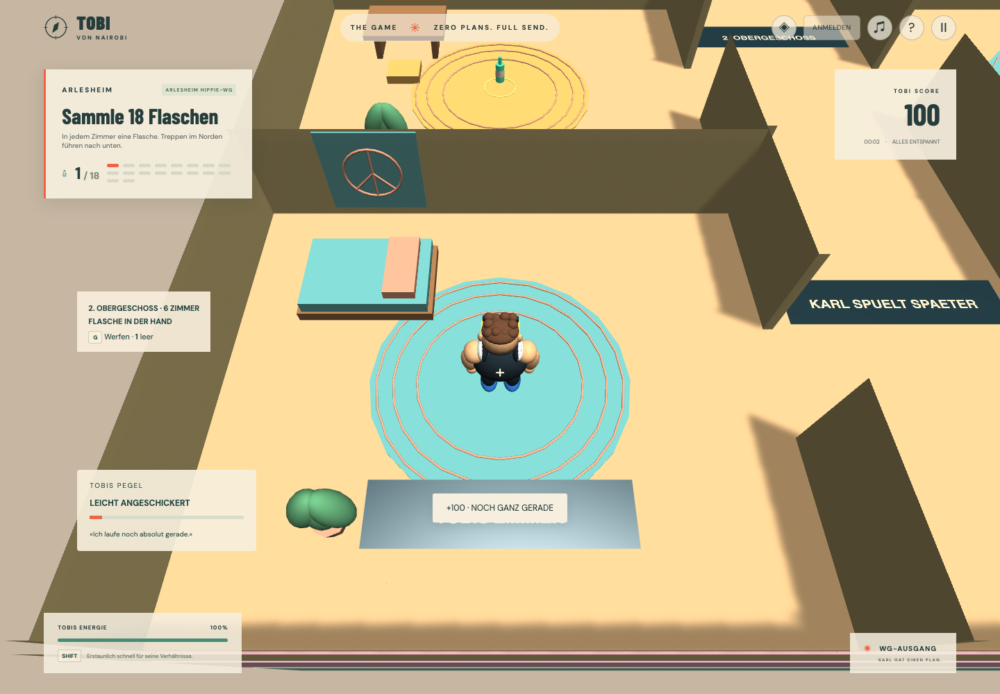

# Arlesheim Hippie-WG

Ein komplettes Innenraumlevel mit **drei real übereinanderliegenden Etagen und sechs getrennten Zimmern pro Etage**. Start in Tobis Zimmer im zweiten Obergeschoss, Ziel an der Haustür im Erdgeschoss. Über **LEVEL WÄHLEN → Arlesheim Hippie-WG → REIN IN DIE WG** direkt spielbar.

## Aufgabe und Wege

Tobi wollte nur kurz jemanden besuchen. Jetzt soll er vor dem Gehen die leeren Flaschen wegräumen. **18 Flaschen**, eine pro Zimmer, führen ihn durch alle Stockwerke. Die vorhandene automatische Trink-/Leergutmechanik bleibt aktiv. Erst nach allen Flaschen lässt sich die Tür im Erdgeschoss mit **E** bestätigen. Der Abschluss gibt **2'300 Punkte** und wird für angemeldete Spieler gespeichert.

| Etage                | Zimmer                                                                      |
| -------------------- | --------------------------------------------------------------------------- |
| Zweites Obergeschoss | Tobis Zimmer, Meditation, Nähstube, Traumzimmer, Gästezimmer, Dachlounge    |
| Erstes Obergeschoss  | Atelier, Yoga, Bibliothek, Musikzimmer, Teestube, Gemeinschaftsbad          |
| Erdgeschoss          | Küche, Esszimmer, Plattenzimmer, Pflanzenzimmer, Velo-Werkstatt, Wohnzimmer |

Je drei Zimmer liegen links und rechts eines zentralen Flurs. Jedes besitzt eine eigene Türöffnung. Das innenliegende Treppenhaus liegt im Norden: links hinunter, auf dem Zwischenpodest wenden, rechts weiter hinunter. Zwei solche Treppen verbinden die drei Etagen. Der Weg ist in beide Richtungen begehbar; vergessene Zimmer bleiben erreichbar. Der Ausgang liegt im Süden des Erdgeschosses. Stockwerksanzeige und Bodenbeschriftungen helfen bei der Orientierung.

Die Palette verändert sich je Etage. Runde gewebte Teppiche, Peace-Wandbehänge, Pflanzen, Palettenmöbel, Kissen, Yogamatten und Plattenregale prägen den Hippie-Stil. Die Zimmernamen und Running Gags wie **KARL SPÜLT SPÄTER** stehen auf Bodenmarkierungen. Ein langsames synthetisiertes Zupfmotiv begleitet den Rundgang. Möbel sind aktuell exemplarische Kulisse; individuelle Küchen-/Bad-/Werkstatt-Interaktionen sind noch nicht umgesetzt.

## Vertikale Technik

Die begehbaren Bodenhöhen sind 0, 4,5 und 9 Meter. Wände, Böden, Treppen und Podeste haben echte Havok-Kollider. Die beiden Treppen verwenden kontinuierliche geneigte Kollisionsflächen mit sichtbaren Stufenmarkierungen, damit die Kapsel nicht an kleinen Stufenkanten hängenbleibt. Es gibt keine Stockwerks-Teleports.

Die erhöhte Innenraumkamera folgt der Spielerhöhe. Oberhalb von Tobi werden die Darstellung der Etagen und ihre Flaschen ausgeblendet; eine grafische Schnittfläche entfernt darüberliegende Wandteile. **Die Physik bleibt erhalten**, auch bei unsichtbaren oberen Stockwerken. Die Kamera verwendet für diese offene Innenraumansicht keine Wand-Ray-Korrektur, da diese sie unter die Geschossdecke drücken würde. Die übrigen Level behalten ihre bisherigen Kameramodi.

Flaschen beachten jetzt beim Platzieren und Animieren ihre Datenhöhe. Nahaufnahme bleibt räumlich begrenzt: Ein Gegenstand an derselben X/Z-Position auf einer anderen Etage wird nicht eingesammelt. Zielabstände berücksichtigen ebenfalls die Datenhöhe. Das Missionssystem verwendet weiterhin Collect und Reach; es enthält keine WG-spezifischen Objective-Handler.

- `game-data/hippie-house.ts`: Etagenabstand, Raumaufteilung, Farben und Namen.
- `game-data/levels/arlesheim-hippie-wg.json`: Spawn, 18 eindeutige Flaschen, Missionsabhängigkeit und Erdgeschossziel.
- `runtime/levels/hippie-house-scene.ts`: Haus, Türöffnungen, Treppen und grafischer Ausschnitt.
- `runtime/levels/hippie-house-props.ts`: wiederverwendbare Möbel und Hippie-Dekoration.
- Bestehende Session-, Score-, Trink-, Sound- und Speicheradapter; keine Datenbankmigration.

## Prüfung und Grenzen

Der Browser-Routentest läuft mit tatsächlicher Havok-Bewegung durch alle 18 Zimmer und beide Treppen bis zur Haustür. Er prüft sechs neue Flaschen pro Etage, reale Spielerhöhen, Rückweg nach oben, Abschlusswert und das Ausblenden der oberen Böden. Kein Teleport oder Missionsabschluss-Hook. Der UI-Test prüft Levelauswahl, Start oben, höhenkorrekte Aufnahme, Trinken und Neustart. PostgreSQL-Integration prüft den eigenen gespeicherten WG-Abschluss ohne Polizeibedingung.

Das Level ist ein kompakter Erkundungsprototyp ohne Polizei, Bewohnerdialoge oder Nebenquests. Möbel haben keine eigenen Physikkörper; Wände und Türen begrenzen die Räume. Die endgültige 5–15-Minuten-Abnahme sowie Safari und Performance auf Referenzhardware bleiben spätere Prüfungen. Die aktuelle Aufgabe lässt sich auf bekanntem Weg deutlich schneller abschliessen.
