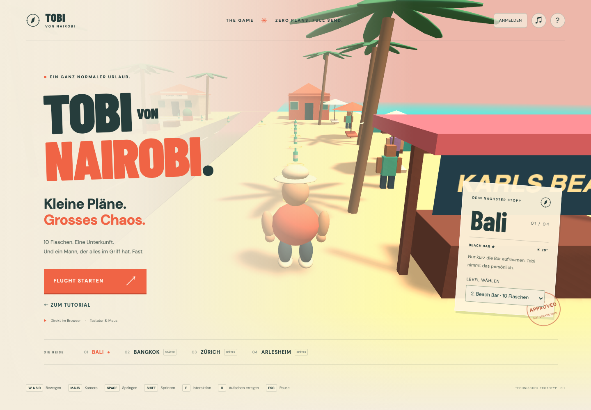
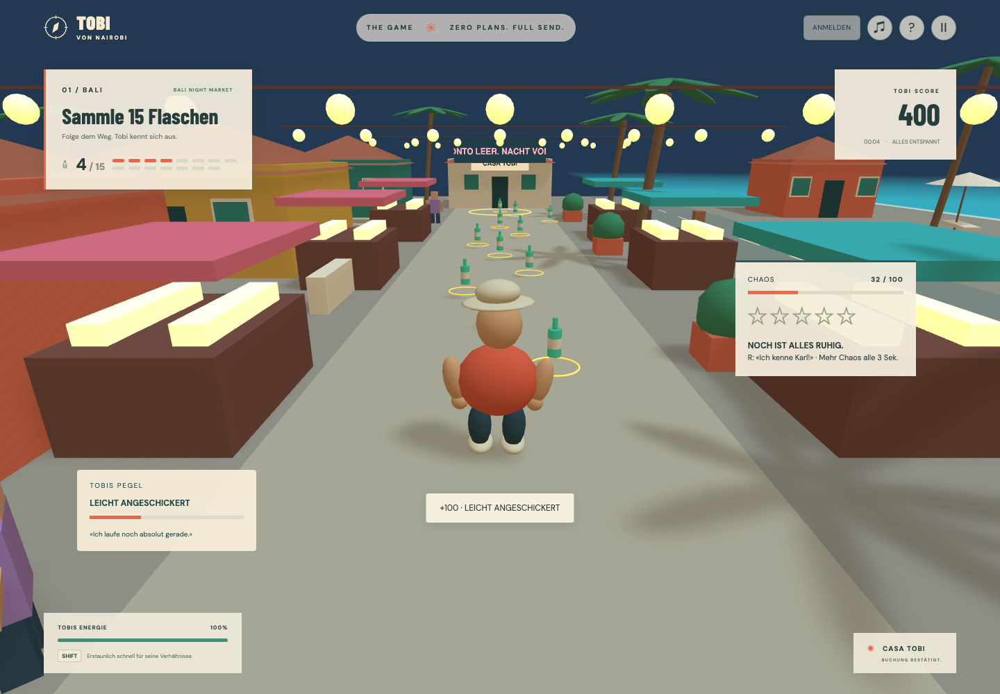

# Bali: neue Levels, Sound und Tobis Pegel

Über **LEVEL WÄHLEN** auf der Zielkarte sind vier eigenständig startbare Level verfügbar. Nach einem Abschluss führt **NÄCHSTES LEVEL →** zur nächsten Auswahl; offene Speicherergebnisse müssen vorher bestätigt werden. Für gespeicherte Durchläufe vor dem Start anmelden.

| Level             | Flaschen | Fahndung maximal | Kulisse                      | Punkte mit einer Flucht |
| ----------------- | -------: | ---------------: | ---------------------------- | ----------------------: |
| Welcome to Bali   |        5 |            keine | sonniges Dorf                |      1'000, ohne Flucht |
| Beach Bar         |       10 |                ★ | Strandbar im Abendlicht      |                   2'000 |
| Bali Night Market |       15 |               ★★ | Nachtmarkt, Stände, Laternen |                   2'500 |
| Bali Escape       |        5 |              ★★★ | Dorf mit Polizeiverfolgung   |                   1'500 |

Das sind vier kompakte spielbare Varianten des Bali-Blockouts mit insgesamt 35 Flaschen. Beach Bar und Night Market ergänzen 25 neue Flaschen; sie ersetzen keine Fahrzeug- oder Bangkok-Kampagnenmission aus dem Gesamtplan. Finale Leveldauer von 5–15 Minuten und umfangreiche Nebenmissionen bleiben spätere Contentarbeit.

## Routen und Balancing

**Beach Bar:** Start am südlichen Strand. Die Sammelroute führt entlang der Küste, dann nach Westen zurück ins Dorf. Nach den letzten Flaschen führt eine Flucht nördlich um den grünen Bungalow, entlang seiner Westseite und zurück zur Casa Tobi. Security steht am Strand, sodass die Verfolgung aus der Route heraus entsteht.

**Night Market:** Start vor dem Markt, 15 Flaschen auf dem Weg zwischen den Ständen und am nördlichen Ende. Eine Flasche liegt etwas rechts neben der Hauptachse; beide Randseiten des Markts sind begehbar. Nach dem Sammeln führt die geprüfte Flucht über die Nord- und Westseite des grünen Bungalows. Sprint für die Ecken aufheben und auf den Sichtkontakt-Countdown achten. Die Guards starten am südlichen Zugang.

Die neuen Level geben acht Chaos pro Flasche, statt die bisherigen 16 unverändert auf die grössere Sammelmenge anzuwenden. Night-Market-Guards laufen mit 4 m/s; andere Verfolger behalten 4,6 m/s. Sichtkontakt, zwölfsekündige Flucht und Missionsgates verwenden weiterhin dieselben Core-Systeme. Mit R lässt sich eine weitere Verfolgung auslösen, falls die erste Flucht vor dem Sammelziel beendet wurde.

## Tobis Pegel und Figurenbewegung

Jede erstmals eingesammelte Flasche erhöht `BottleMood` um 1/12, begrenzt auf 100 %. Die Anzeige verwendet vier humorvolle Zustände: **NOCH GANZ GERADE**, **LEICHT ANGESCHICKERT**, **ORDENTLICH SCHWANKEND**, **VOLLE SCHLAGSEITE**. Es gibt keine Promilleberechnung. Der Pegel gilt nur für diesen Durchlauf und beginnt beim Neustart oder Levelwechsel wieder bei null.

Der Pegel verstärkt seitliches Schwanken, Kopfbewegungen, asymmetrische Schritte und ausgleichende Arme. Ab rund 40 % kommen beim Laufen periodische Stolperposen hinzu. Pickups lösen eine kurze Armbewegung aus; Sprünge haben eigene Bein-/Armhaltungen, Erschöpfung neigt den Körper nach vorne, und beim Sieg tanzt Tobi mit Beinen, Armen, Wippen und Drehung.

Die hierarchischen Hüft- und Schultergelenke bewegen Schuhe und Hände mit. Nur der sichtbare Körper unterhalb des stabilen Spieler-Roots schwankt: Richtungseingabe, Geschwindigkeit, Kollision, Stamina, Kamera und Wertung bleiben unverändert. Die Bewegung wird in Pause eingefroren. Die reine Poseberechnung und der Pegel liegen im enginefreien `game-core`; das Babylon-Rig setzt die Pose um.

Beach Bar hat drei, Night Market vier dekorative Passanten. Sie bewegen Kopf und Arme und winken dem schwankenden Tobi in ihrer Nähe zu. Guards schwingen beim Laufen Arme und Beine. Die Passanten sind Kulissenfiguren ohne Dialog-, Kollisions- oder Quest-AI.

## Sound

Eigene synthetisierte Effekte für Flaschenklingen, Schritte, Absprung, Landung, Schluckauf, Stolpern, Alarm, erfolgreiche Flucht, Festnahme, Karls Spruch und Sieg. Dazu kommen wiederkehrende Sirenen bei aktiver Fahndung und leise Tages-/Nacht-Ambient-Cues. Es werden keine externen Audiodateien, Sprachaufnahmen oder Musik-CDNs benötigt.

Ein Master-Gain schaltet alle Sounds stumm, einschliesslich bereits geplanter Töne. Die Stimmeanzahl ist auf 24 gleichzeitig begrenzt. Pause stoppt Stimmen und suspendiert den Audiokontext; Levelwechsel/Neustart schliessen ihn. Die Audiofreigabe erfolgt direkt beim Klick, bevor der angemeldete Lauf über die API angelegt wird. Die API-Nutzung berücksichtigt [Browser-Autoplay und Lautstärkekontrolle](https://developer.mozilla.org/en-US/docs/Web/API/Web_Audio_API/Best_practices) sowie [AudioContext.suspend](https://developer.mozilla.org/en-US/docs/Web/API/AudioContext/suspend). Fehlende Audio-Unterstützung blockiert das Spiel nicht.

## Daten und Modulgrenzen

- `game-data/levels`: zwei zusätzliche JSON-Level; bestehende Level-IDs, Flaschen und Punkte bleiben erhalten.
- `contracts/content`: validierte Atmosphäre, Kulissentyp, Chaos pro Flasche und Gegnergeschwindigkeit mit rückwärtskompatiblen Defaults.
- `game-core/character/bottle-mood`: Pegel und reine Poseberechnung.
- `runtime/character/tobi-visual`: prozedurales Rig und kurzlebige Animationszustände.
- `runtime/audio/audio-feedback`: Soundkatalog, Stimmen, Master-Gain und Ressourcenlebensdauer.
- `runtime/levels/bali-venues` und `bali-crowd`: Kulissen und dekorative Figuren.
- `GameHost`: verbindet bestätigte Pickups, Bewegung, Verfolgung, Darstellung und Audio.

Missionstexte, Sammelzähler, Levelnamen und Kontoanzeigen verwenden die Leveldaten. Die existierende Abschluss-API unterstützt die neuen IDs ohne separate Missionslogik oder Datenbankmigration. `contentVersion` bleibt `prototype-2`: bestehende Levelregeln und gespeicherte Ergebnisse bleiben kompatibel; neue Inhalte kommen unter neuen IDs hinzu.

## Nachweise

Unit-Tests prüfen Pegelbegrenzung, neuen Durchlauf und stärkere/asymmetrische Posen. Browser-Routentests sammeln sämtliche Flaschen und schliessen beide neuen Levels mit tatsächlicher Havok-Bewegung, Kollisionen, Sicht-Raycasts und Verfolgung ab. Kein Teleport oder Abschluss-Hook wird dafür verwendet. PostgreSQL-Integration prüft die Fluchtbedingung und gespeicherten Punkte für alle drei Verfolgungslevels.

Der UI-Test wechselt die Kulissen, sammelt echte Flaschen, prüft die steigende Pegelanzeige und deren Rücksetzung. Ein zusätzlicher Browser-Test misst die echte Audioausgabe am Audiographen und prüft Stummschaltung, Pause, Fortsetzung und Schliessen des Kontexts. Künstlerische Soundabnahme mit Lautsprechern/Kopfhörern und die 60-FPS-Abnahme auf Referenzhardware bleiben manuelle Aufgaben.

