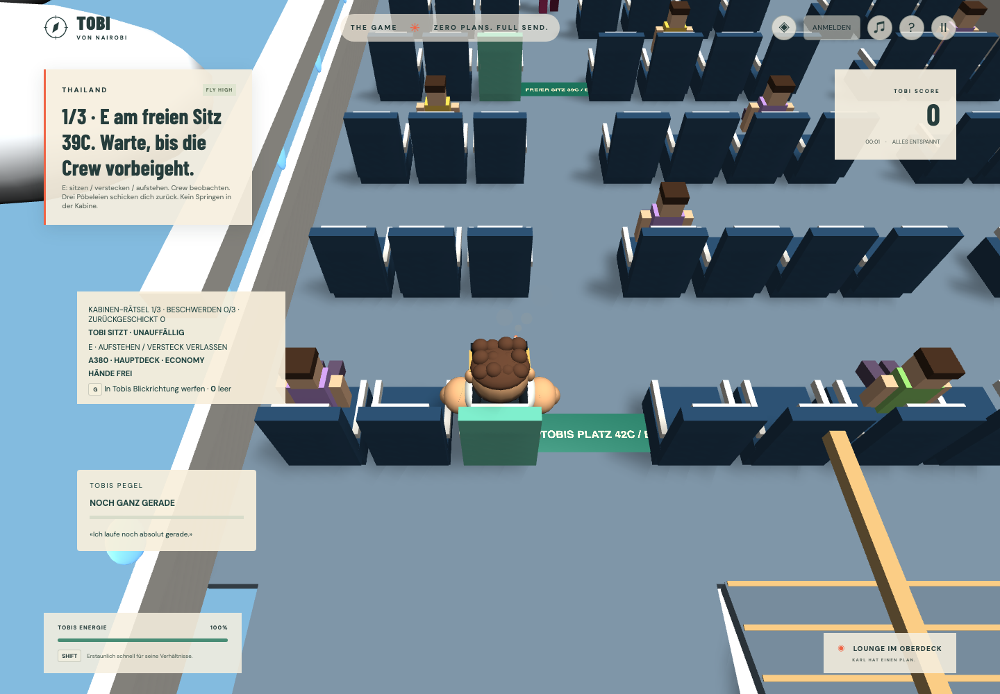

# Fly High — Economy gebucht. Lounge erreicht.

Ein Rätsel-Level ohne Polizei, ohne Flaschenpflicht und ohne Zeitlimit. Tobi sitzt am hinteren Ende eines A380-inspirierten Flugzeugs auf Platz 42C. Sein Ziel ist die Lounge vorne im Oberdeck. Die Kabine fliegt: Wolken ziehen an Fenstern, Tragflächen und vier Triebwerken vorbei; gedämpftes Triebwerksrauschen und ein gelegentlicher Bordgong ersetzen die Aussenatmosphäre.

## Ablauf und Bedienung

- **E** steht auf, setzt Tobi auf einen markierten freien Sitz oder versteckt ihn im WC. Bewegungstasten verlassen einen Sitz nicht versehentlich. Kamera und Pause bleiben bedienbar.
- Erst den freien Sitz **39C** erreichen, Platz nehmen und eine Flugbegleiterin tatsächlich vorbeigehen lassen. Nur kurz auf E drücken erfüllt das Ziel nicht.
- Danach im mittleren **WC** verstecken und den vorbeiziehenden Bordservice abwarten. Die drei WC-Wände sind physisch, der Einstieg liegt am linken Gang.
- Über die vordere oder hintere echte Treppe ins Oberdeck. **Karls Lounge-Karte** liegt am hinteren Ende der Mittelkonsole. Beide Gänge und der Quergang erlauben es, die Crew zu umgehen. Anschliessend vorne rechts mit E abschliessen.
- Drei Pöbeleien mit **R**, auch im Versteck, schicken Tobi zurück auf seinen Sitz. Ebenso wird er bei Sichtkontakt im vorderen Sichtkegel oder unmittelbarem Kontakt von einer Flugbegleiterin zurückgeschickt. Sitz- und WC-Verstecke schützen vor Entdeckung, nicht vor Beschwerden.
- Eine Rücksetzung leert Rätsel-Fortschritt und Beschwerden. Die Uhr läuft weiter, Rücksetzungen werden gezählt und Tobi kann sofort wieder mit E aufstehen. Es gibt keinen Game-over-Dialog, keine Fahndungssterne und keine Zelle.
- Getränkewagen und stehende Passagiere blockieren echte Laufwege. Kreuzungen zwischen Sitzblöcken bieten Alternativen. In der Kabine gilt halbes Lauftempo (2,9 m/s, Sprint 5,1 m/s); Springen ist hier deaktiviert, damit Sitzreihen und Wagen keine bedeutungslosen Hindernisse werden.

Im Zug sind die freien Bänke hinten links und zwei Reihen weiter rechts ebenfalls mit E nutzbar. Das ist dieselbe Spieleraktion, ohne Flugzeugregeln und ohne Freischaltbedingung. Sitzen stoppt die Bewegung und lässt normale Stamina-Erholung zu; der Sitzwechsel füllt die Energie nicht schlagartig auf.

## Kabine und Referenzen

Die [Airbus-A380-Beschreibung](https://www.airbus.com/en/products-services/commercial-aircraft/passenger-aircraft/a380) bestätigt zwei durchgehende Passagierdecks. Die [Emirates-A380-Flottenseite](https://www.emirates.com/us/english/experience/our-fleet/a380/) dient als Referenz für die räumliche Trennung der Kabinen und Bordbereiche. A380-Bestuhlung unterscheidet sich nach Betreiber und Ausführung.

Unsere fiktive Kabine besitzt unten **3–4–3** mit zwei Gängen und 160 Sitzen; oben **1–2–1** mit 44 Business-Sitzen. Dazu kommen Fenster, Kopflehnen, Armlehnen, Gepäckfächer, Bordküchen, Toilette, Mittelkonsole und je eine Treppe an beiden Enden. Das ist ein stilisierter Ausschnitt mit 204 Sitzen, keine vollständige Airline-Sitzplan-Replik. Breite und Reihenabstände sind für die vorhandene Tobi-Figur und ihre Physikkapsel vergrössert. Es werden keine fremden Bilder, Logos oder Flugzeugmodelle ausgeliefert.

Die Kamera dreht 360°. Das Oberdeck wird ausgeblendet, während Tobi unten ist; die Kollisionskörper bleiben bestehen. Treppen nutzen durchgehende Rampen mit optischen Stufen. Ihre obere Landung beginnt erst am tatsächlichen Rampenende: Eine früher beginnende Landung erzeugte im Physiktest eine unpassierbare Kante und wurde korrigiert.

## Modulgrenzen

| Modul                              | Verantwortung                                                                                                        |
| ---------------------------------- | -------------------------------------------------------------------------------------------------------------------- |
| `game-core/character/seating.ts`   | Sitz-/WC-Zustand, nächster erreichbarer Platz und sicherer Ausgang; keine Engineimporte                              |
| `game-core/flight/cabin-puzzle.ts` | Patrouillen, Sichtkegel, Versteckreihenfolge, Kartenposition, Beschwerden und Rücksetzungen; injizierte Sichtprüfung |
| `game-data/aircraft.ts`            | Sitzgruppen, Interaktionsanker, Crew-Routen und Rätselkonfiguration                                                  |
| `game-data/levels/fly-high.json`   | Level-ID, Start, Ziel, Mission und keine Polizei                                                                     |
| `runtime/levels/aircraft-scene.ts` | Geometrie, statische Hindernisse, Passagiere, Wolken und Deckausblendung                                             |
| `runtime/flight/flight-runtime.ts` | Crew-Animation und Sichtprüfung gegen die echten Szenencollider                                                      |
| `runtime/session/game-host.ts`     | Verdrahtung mit Eingabe, Character Motor, Sitzpose, HUD und normalem Levelabschluss                                  |

Neue Sitzgelegenheiten brauchen nur `LevelScene.restSpots`: stabile ID, Bezeichnung, Sitzposition, Blickrichtung und ein geprüfter freier Gang-Ausgangspunkt. Stockwerk und Entfernung werden vor dem Einstieg geprüft. `GameView` überträgt nur Haltung, Interaktionshinweis und die kleine Rätselprojektion, keine Engineobjekte.

Die Zonenregeln dieses Levels sind datenparametrisiert. Es gibt keine echte Bordservice-Simulation, dynamische Getränke-Bestellung oder freien Toiletten-Dialog. Das Zurückschicken ist ein kurzer Arcade-Rücksprung, kein animierter Escort-Weg. Passagiere und Wagen sind feste räumliche Hindernisse; die Crew patrouilliert.

## Prüfung

- Unit: Sitzreichweite/Stockwerk, sicherer Ausgang, tatsächliche Crew-Passage, korrekte Reihenfolge, fehlende Kartenabholung, getrennte Decks, Sichtdeckung und dritter Zuruf trotz Versteck.
- Browser/Physik: Ein vollständiger Lösungsweg mit Havok bewegt Tobi zu Sitz und WC, um die Wagen, über die vordere Treppe, zur Karte und zur Lounge. Nur reguläre Sitz-/WC-Interaktionen versetzen den Character. Die Crew benutzt echte Collider-Sichtlinien; der Weg schafft es ohne Rücksetzung. Der bekannte Lösungsweg dauert rund 112 simulierte Sekunden, kein Nachweis für 5–15 Minuten Erstspielzeit.
- E2E: Gaststart, Anfangssitz, Aufstehen, erneutes Sitzen, drei Beschwerden und Rückkehr auf 42C; ausserdem dieselbe Sitzaktion im Zug und anschliessende Weiterbewegung.
- Die Galerieprüfung umfasst auch das Fly-High-Vorschaubild. `PREVIEW_LEVEL=fly_high pnpm assets:previews` erzeugt nur dieses Vorschaubild.

Screenshots belegen die Darstellung in Chromium. Safari, Referenzhardware/FPS und menschliche Abnahme des Schwierigkeitsgrads bleiben separate Prüfungen. Der Server speichert wie bei den bisherigen Levels nur das abgeschlossene Ergebnis; die Kabinenrätsel-Ausführung wird nicht serverautoritativ simuliert.

