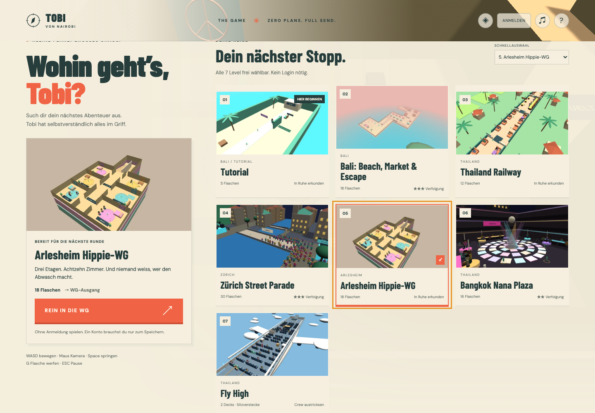

# Levelauswahl ohne Anmeldung

Die Startseite zeigt alle sieben spielbaren Level als Bildkarten. **Karte 01 heisst „Tutorial“**, standardmässig ausgewählt und mit „Hier beginnen“ gekennzeichnet. Grosse Anleitungen führen dort durch Bewegung, Kamera, Sprung, Sprint, Flaschenaufnahme, Werfen, Anpöbeln, Deckung und Sitzen ohne Polizei.

Eine Karte auswählen und den Startknopf beim ausgewählten Level betätigen. Die gewählte Karte erhält eine farbige Umrandung und ein Häkchen. Alle Level bleiben ohne Account und ohne vorherige Freischaltung direkt erreichbar. Das Dropdown dient weiterhin als kompakte Schnellauswahl. Karten sind per Tab/Enter bedienbar; auf schmalen Fenstern bleibt die Galerie vertikal scrollbar.

Für Gastspiel ist keine erfolgreiche Konto-/API-Abfrage erforderlich. Läuft beim Start noch die Session-Abfrage, beginnt die Runde als Gast. Eine verspätete Kontoantwort schreibt diesen bereits begonnenen Durchlauf keinem Account zu. Für gespeicherte Runden vor dem Start anmelden. Bereits bekannte Konten verwenden weiterhin die vorhandene Run-/Save-API mit ihren Schutzmechanismen für offene Ergebnisse.



## Vorschaubilder aktualisieren

Die Vorschaubilder sind echte Aufnahmen der prozeduralen Spielwelten, keine externen Bilder. Sie liegen als 640 × 360 WebP unter `apps/game-client/src/assets/level-previews/`, benannt nach der stabilen Level-ID. Die sieben angezeigten Bilder benötigen zusammen weniger als 200 KiB. Vite verarbeitet die Dateien als versionierte Build-Assets; die Galerie selbst startet keine zusätzlichen 3D-Szenen.

Nicht jedes Level erscheint in der Galerie: `levelSchema.selectable` markiert Kapitel, die nur durch ein Spielereignis erreichbar sind. Die Ausnüchterungszelle ist so ein Fall und braucht deshalb kein Vorschaubild. Die drei früheren Bali-Karten bleiben nur als alte Inhalts-IDs erhalten; die Galerie zeigt stattdessen `bali_adventure`.

Bei neuen Levels oder grösseren Kulissenänderungen:

```bash
# Terminal 1
pnpm dev:client

# Terminal 2; Chromium zuvor mit pnpm exec playwright install chromium installieren
pnpm assets:previews
```

Mit `PREVIEW_LEVEL=fly_high` lässt sich gezielt ein einzelnes Level neu aufnehmen. Optional `PREVIEW_BASE_URL` setzen, falls der Entwicklungsclient nicht unter `http://127.0.0.1:5173` läuft. Das Werkzeug lädt den separaten Entwicklungs-Einstieg `test/level-previews.html`, rendert echte Levelgeometrie und kodiert das Canvas direkt als WebP. Perspektiven sind in `test/level-previews.ts` definiert. Neue Bilder vor dem Commit visuell prüfen. Der Aufnahme-Einstieg wird nicht in den Produktionsbuild eingebunden; die eingecheckten Bilder machen Chromium im normalen Build überflüssig.

## Prüfung

Browserprüfungen kontrollieren Tutorial-Reihenfolge, Bilddateien, Kartenwechsel per Tastatur, Gaststart bei ausgefallener API, Rückkehr zur Auswahl und schmale Fenster. Ein kontrolliert verzögerter Session-Response prüft den sofortigen Gaststart und die korrekte Ergebnisanzeige nach einer verspäteten Kontoerkennung. Die bestehenden angemeldeten Speicher-/Reload- und Gameplaytests bleiben erhalten.
