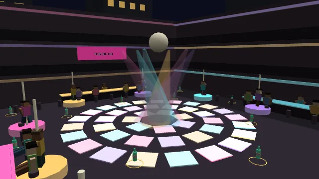

# Bangkok Nana Plaza und die Ausnüchterungszelle

## Raumfolge und Referenzen

Nana Plaza ist ein zusammenhängender Nachtstadt-Level: **Nana BTS → Sukhumvit → Soi 4 → Eingang → Innenhof → zwei obere Galerieebenen → Rückweg zum BTS**. Alle Übergänge erfolgen zu Fuss. Die Level-ID `bangkok_nana_plaza`, die 16 Flaschen-IDs und die Missionsziele bleiben stabil.

Als visuelle Referenzen dienen die [Betreiberseite](https://nanaplazabkk.com/), ihr [Galerie-/Innenhoffoto](https://nanaplazabkk.com/wp-content/uploads/2024/01/nana-plaza-bangkok.jpg), das [Eingangsfoto](https://nanaplazabkk.com/wp-content/uploads/2022/12/nana-plaza-square.jpg), die [Lagebeschreibung der Plaza](https://en.wikipedia.org/wiki/Nana_Plaza) sowie die [Stationsbeschreibung Nana E3](https://en.wikipedia.org/wiki/Nana_BTS_station). Die Station liegt entlang Sukhumvit östlich der Nana-Kreuzung; das Spiel verkürzt und dreht die Strecke. Es übernimmt die schmale Eingangspassage, den dreigeschossigen Hof mit gegenüberliegenden Galerien, Schilderbänder, Beer-Garden und hohe Überdachung. Referenzfotos werden nicht als Spieltexturen übernommen.

Dies ist eine stilisierte Rekonstruktion, kein vermessenes Stadtmodell. Die Treppen liegen für eine klare Spielerroute im rückwärtigen Annex. Bars und Biermarken tragen erfundene Namen; es besteht kein dargestelltes Sponsoring realer Betriebe.

## Welt und Navigation

Die Welt umfasst etwa 148 × 176 Meter, Geschosshöhen 4,8 Meter. Start ist auf dem acht Meter hohen BTS-Bahnsteig. Ein über die Strasse laufender Zug bremst, hält, öffnet Türen und fährt wieder ab. Bahnsteig, Gates, Beschilderung, Trasse, Pfeiler und Treppen bilden eine zusammengehörige Station. Eine zusätzliche Rolltreppe verwendet animierte Stufen über einer kontinuierlichen Kollisionsrampe.

Sukhumvit enthält Fahrspuren, Bürgersteige, animierte Taxis/Tuk-Tuks/Busse, modular wiederholte Geschäftshäuser, Hotels, Werbetafeln und Klimageräte. Soi 4 wird schmaler: Markisen, Kabelbündel, Streetfood-Wagen, Roller, Barfronten, ATM/Exchange, Passanten und Leuchtschilder führen zur Plaza. Gebäude und sichtbare Baustellenbegrenzungen schliessen die Welt ab. Verkehr ist eine animierte Kulisse, keine vollständige Verkehrssimulation.

Die Plaza hat drei wirklich begehbare Ebenen. Beide Seitenflügel und der hintere Flügel besitzen tragende Böden. Der Hof bleibt durch alle Ebenen offen; obere Geländer bestehen aus sichtbaren Pfosten/Handläufen und kollidierenden transparenten Füllungen. Die WG-Technik mit kontinuierlichen Rampen und visuellen Trittstufen verhindert das bekannte Havok-Hängenbleiben an kleinen Stufen. Die 360°-Kamera verwendet weiterhin ihre fünf Hindernisproben. Keine globalen Clipplanes schneiden den Innenhof weg.

## Venues und Interaktionen

| Ebene        | Umfang                             | Identität                                                                |
| ------------ | ---------------------------------- | ------------------------------------------------------------------------ |
| Ground Floor | 10 Fronten plus 6 offene Hoftheken | Beer-Bars, fiktive Marken, kleine Tische und Hocker                      |
| Second Floor | 5 vollständig begehbare Bars       | Rot, Violett, Rock, LED und Cabaret                                      |
| Third Floor  | 4 vollständig begehbare Venues     | Supernova Signature Club, Prism Cabaret, Midnight Orchid, Electric Lotus |

Authoring-Modi sind `facade`, `shallow` und `full`. Geschlossene Fronten besitzen ein sichtbares Rollo. Offene Räume haben eine vier Meter breite Tür, Sitzbänke, Theke, Regal, Kühlschrank, Screens, Spiegeloptik, Lautsprecher und farbige Emissionsflächen. Obere Räume haben Bühnen und Stangen; Supernova ergänzt mehr Bühnenplätze und einen DJ-Bereich. Die Spiegel sind derzeit stilisierte reflektierende Farbflächen, keine zusätzlichen Renderkameras.

- **F:** sichtbare Performer oder Barpersonal im Umkreis von fünf Metern ansprechen/flirten. Durch Wände oder zwischen Geschossen gibt es keine Antworten. Jeder NPC zählt seine Annäherungen separat; jede vierte wird freundlich abgelehnt.
- **R:** umliegende sichtbare NPCs anpöbeln und Chaos erzeugen.
- **E:** auf einer freien Sitzbank sitzen oder aufstehen; an einer Theke die Getränkekarte öffnen.
- Getränkekarte: **F** wählt, **E** kauft, Weggehen schliesst. BEER 150 THB, SHOT 200 THB, WATER 80 THB. Das lokale Startbudget beträgt 1200 THB; keine Kontowährung oder Datenbankbuchung. Käufe geben Energie und eine Trinkpose, Alkohol erhöht den Arcade-Pegel. Kein Geld: „KONTO LEER · WARENKORB VOLL“.

Eine E-Eingabe wird nur einmal verarbeitet. Sitzplätze verwenden das vorhandene `Seating` mit validiertem Ausstiegspunkt. Das lokale Getränkebudget wird beim Neustart zurückgesetzt und kann nicht negativ werden.

## NPCs und Tänze

Die Authoring-Daten enthalten 40 Strassenpersonen, 40 Hofgäste und zusätzliche Venue-Besetzungen. Rollen: Bartender, Dancer, Ladyboy Dancer, Security, Tourist, Expat, Street Vendor und Taxi Driver. Alle Performer sind erwachsene Figuren und verwenden dieselben respektvollen sozialen Regeln; Geschlechtsidentität ist kein Witz oder abweichender Spielwert.

Ambient-Verhalten umfasst kurze Lauf-/Querungswege, Gespräch, Getränk-, Rauch-, Telefon- und Heranwink-Posen. Die Wege bleiben absichtlich lokal und werden nicht als allgemeine Fussgänger-Verkehrsplanung ausgegeben. Performer verwenden acht wiederverwendbare Profile: `dance_idle_01/02`, `dance_slow_01/02`, `dance_pole_01/02`, `dance_club_01/02`. Phase und Tempo variieren deterministisch pro Figur.

Höchstens 32 detaillierte Rigs werden nach Nähe zugeteilt und wiederverwendet. Weitere Personen erscheinen in sechs Thin-Instance-Gruppen. Nahe Figuren animieren vollständig, mittlere mit reduzierter Frequenz, entfernte mit wenigen Posen pro Sekunde. Nicht sichtbare nahe Rigs überspringen die Animation. Es gibt keine individuellen NPC-Physikcontroller oder Render-Observer. Interaktionsidentität, Dialogfortschritt und Wurfreaktion bleiben beim Rig-Wechsel erhalten.

`NpcVoices` und `SpeechBubbles` bleiben die gemeinsame Sprachpipeline. Neue englische Rollen- und Situationsdialoge reagieren auf Betrunkenheit und Chaos. Die Sprechblasen verwenden weiterhin den festen Pool. Betriebssystem-Stimmen sind optional; Text funktioniert auch ohne TTS.

## Chaos, Security, Polizei und Ziel

Die 16 Flaschen verteilen sich wie folgt: **2 BTS/Sukhumvit, 4 Soi 4, 4 Ground Floor, 3 Second Floor, 3 Third Floor**. Jede füllt weiterhin Energie und erhöht Chaos um sieben. Die bestehenden acht Arcade-Farbtabletten bleiben im Hof.

| Chaos  | Reaktion                              |
| ------ | ------------------------------------- |
| 0–20   | normales Nachtleben                   |
| 21–40  | Eingangssicherheit beobachtet/warnt   |
| 41–60  | kurze Security-Verfolgung im Innenhof |
| 61–80  | Polizei auf der Soi, ein Stern        |
| 81–100 | verstärkte Verfolgung, zwei Sterne    |

Die Eingangssicherheit nutzt das bestehende NavigationGrid, verfolgt nur kurz im Erdgeschoss-Hof und begleitet einen erwischten Spieler entlang eines Pfads hinaus. Die Begleitung gibt Bewegungsabsichten an den normalen Havok-Motor; sie teleportiert nicht. Danach gilt eine Schonfrist. **Security führt niemals in die Zelle.** Sie ist derzeit kein etagenübergreifender Verfolger.

Polizei bleibt ein Boden-Navigationssystem. Böden, Treppen und obere Wände blockieren ihr Erdgeschossraster nicht. Sicht und Festnahme berücksichtigen die Spielerhöhe: niemand wird durch eine Geschossdecke gesehen oder festgenommen. Die Fahndung kann beim Erkunden höherer Ebenen weiter bestehen. Nach allen 16 Flaschen muss Tobi tatsächlichen Polizeikontakt verlieren und den markierten BTS-Ausgang erreichen. Ein früheres Abhängen erfüllt das nachgeschaltete Fluchtziel nicht.

## Audio und Licht

Audiozonen gehören zu Sukhumvit, BTS, Soi, Hoftheken und einzelnen Bars. Ein Mixer wählt die stärksten vier Quellen, glättet Distanzgewichte und berücksichtigt Höhenunterschiede. Beim Betreten dominiert die jeweilige Bar; im Hof überlagern sich mehrere Rhythmen. Alle Quellen gehen durch den vorhandenen Audio-Masterbus: Pause, Stummschaltung und Dispose gelten weiter.

Verkehr, Hupen, Zuggeräusche, Brems-/Türgeräusche, Stimmenatmosphäre und verschiedene Musikrhythmen sind hier prozedurale Arcade-Sounds. Es werden keine fremden Musikaufnahmen eingebunden. Die bestehende SoundBank für Foley bleibt erhalten. Kein Anspruch auf authentische Ortsaufnahmen oder vollwertige Musikstücke.

Neon und Festoon-Lichter sind emissive Geometrie. Sechs gemeinsame Farbpaletten pulsieren; die Bars erhalten getrennte Farbthemen. Es gibt keine zusätzlichen dynamischen Punktlichter. Beleuchtung und Fassaden sind prozedural; echte Lightmaps sind noch nicht Teil der Asset-Pipeline dieses Levels.

## Architektur und Performance

`packages/game-data/src/nana-plaza/` enthält Weltmasse/Tour, Venue-/Drink-Daten und Bewohner. `nana-plaza.ts` bleibt der öffentliche Export. Das Level-JSON enthält Spawn, Ziel, Pickups und optionale datengetriebene `wantedThresholds`.

`runtime/levels/nana-plaza/` trennt Builder/Atlas, Strassen, BTS, Plaza, Innenräume, Ambient-Details, Population, entfernte Instanzen, Security, Barinteraktionen und Audiozonen. Die alten `nana-plaza-scene.ts` und `nana-venue.ts` bleiben kleine kompatible Einstiegspunkte. `LevelScene` erhielt optionale Interaktion-/Audio-Verträge; andere Levels müssen sie nicht implementieren.

Ein 2048²-Atlas fasst bis zu 128 Schilder zusammen. Props teilen Geometrie und Materialien über Instanzen. Innenraumdetails werden nach Entfernung und Höhe ausgeblendet; Galerien und Schilder bleiben sichtbar, die Physik bleibt aktiv. Das ist Sector-Visibility, **kein** asynchrones Chunk-Streaming. Der gesamte Grundriss bleibt geladen.

Die Content-Version ist `prototype-5-nana`; bei späterem Backend-Deployment müssen Client und Server dieselben Content-Daten verwenden.

Der verifizierte lokale Vollaufbau mit NPC-Pool umfasst etwa 2150 Meshes/Instanzen und 165 Materialien. Die Anzahl ist keine Draw-Call- oder FPS-Messung. 60 FPS bleiben ein Ziel, das auf echten Desktop-Geräten geprüft werden muss; es gibt noch keine allgemeine Leistungsgarantie.

## Ausnüchterungszelle

Die Zelle (`selectable: false`, World `custody`) bleibt ausschliesslich über Festnahme erreichbar. „AB IN DIE ZELLE“ lädt ihre eigene Session; alternativ ist ein Neustart möglich.

Bett, Toilette, Tisch, Gitter, Wärter und das kurze Kameraprofil bleiben bestehen. **R** ruft den Wärter; **E** an der Pritsche beendet die Nacht. Keine Pickups, keine Punkte, kein Abschlussbonus und keine Speicherung eines Zellenaufenthalts. Das Ergebnis führt zurück zum Tutorial-Menü.

## Lokale Prüfung

Keine GitHub-CI. Der Umbauplan liegt in [nana-expansion-plan.md](../development/nana-expansion-plan.md).

- Unit: Flaschenverteilung, Venue-Zahlen, NPC-Rollen, Dialogkonsistenz, Dispatch-Schwellen, Höhen-Sichtschutz und unveränderte Zellen-Eigenschaften.
- Browser-Harness `test/nana-harness.ts`: tatsächliche Havok-Bewegung vom Bahnsteig durch die Soi über beide Treppen, alle neun oberen Venue-Eingänge, Flirt und Getränkekarte.
- Menü-E2E: neuer Stationsweg mit normalen Tasten, Flirt/Kauf/Pöbeln; die vorhandenen Festnahme-/Zellen-Tests verwenden den neuen Weg. Keine Tests wurden entfernt.
- `playwright.nana-local.config.ts` ist ausschliesslich ein manuell aufrufbarer lokaler Test gegen laufende Server (Client-Preview 4175, physischer Harness 5173). Es startet keine CI und keine Datenbank.

### Prüfstand dieses Ausbaus

Client-Typecheck/Produktionsbuild und gezieltes ESLint: bestanden. 22 fokussierte Unit-Tests: bestanden. Lokale Browserfälle: vollständige Havok-Route inklusive Kamera, alle Flaschen und Abschluss; Menü/Flirt/Kauf/Pöbeln; Festnahme/Neustart; Festnahme/Zelle/Wärter/Pritsche. Die Tests laufen bewusst manuell; keine Workflow-Datei wurde wieder aktiviert. Ausgelassene Gesamt-Suites gelten nicht als bestanden.

