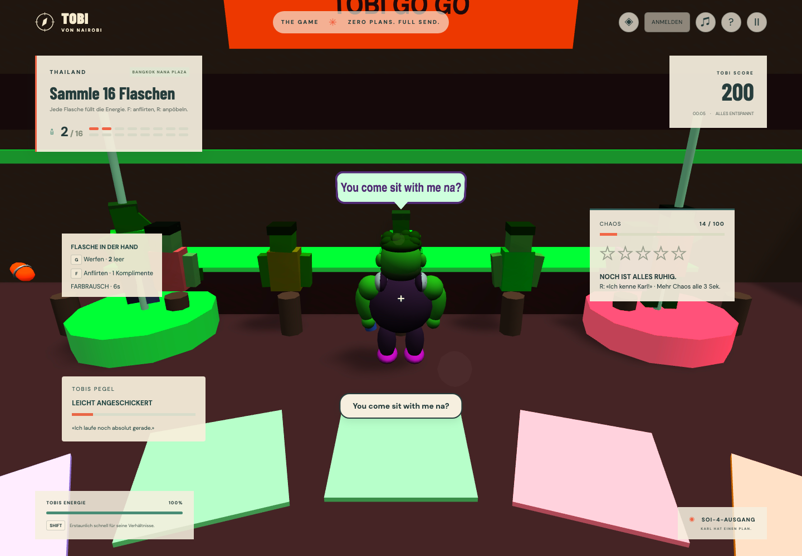
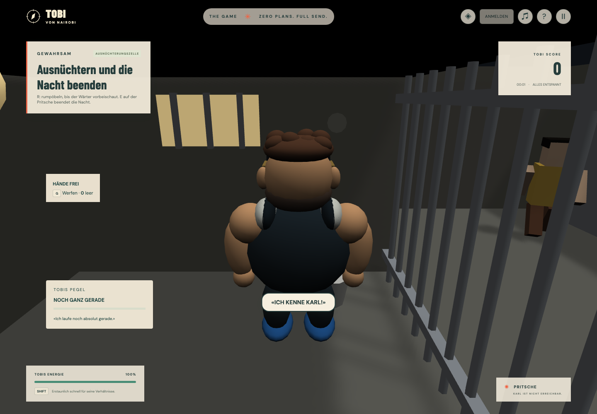

# Bangkok Nana Plaza und die Ausnüchterungszelle

Zwei neue Kapitel mit gegensätzlicher Stimmung: ein lautes Innenhof-Venue voller Neon und ein sehr stiller Raum mit Gitterstäben. Nana Plaza steht als **Level 08** in der Galerie. Die Zelle nicht: sie ist ausschliesslich über eine Festnahme erreichbar und in `levelSchema` mit `selectable: false` markiert.

## Bangkok Nana Plaza

**Aufgabe:** 16 Flaschen im Innenhof sammeln, die Security abhängen und über den Soi-4-Ausgang verschwinden.

Ein dreistöckiger U-förmiger Barblock umschliesst den Hof: Westflügel, Ostflügel und Nordflügel, jeweils mit Balkonen, Geländern und Leuchtbändern pro Stockwerk. Sieben Hochhäuser mit Fensterrastern stehen ausserhalb und schliessen den Himmel. Der einzige Zugang ist der Soi im Süden; dort liegt auch das Ziel.

In der Mitte liegt eine **Discofläche** aus 42 einzeln angesteuerten Bodenplatten. Sie wechseln im Takt durch vier Neonfarben. Darüber dreht sich eine Spiegelkugel mit sechs Lichtkegeln, deren Sichtbarkeit auf denselben Beat reagiert. Der Effekt besteht vollständig aus emissiver Geometrie: keine zusätzlichen dynamischen Lichter, kein Post-Processing, damit das Bildbudget der übrigen Level unverändert bleibt.

Acht **Podeste mit Stangen** verteilen sich um die Tanzfläche und entlang der Flügel. Auf jedem tanzt eine Go-go-Tänzerin: eine Hand an der Stange, Hüfte und Beine auf dem Beat, das Podest dreht sich langsam. An drei Bartheken stehen Personal und Gäste auf Hockern.

### Anpöbeln und Anflirten

| Taste | Wirkung                                                                                         |
| ----- | ----------------------------------------------------------------------------------------------- |
| **R** | Wie bisher: alle Figuren im Umkreis von acht Metern erschrecken, +20 Chaos, drei Sekunden Pause |
| **F** | Neu: das nächste sichtbare Gegenüber innerhalb von fünf Metern bekommt ein Kompliment           |

**F** wirkt nur auf Tänzerinnen und Barpersonal, nicht auf Gäste, und nur mit freier Sichtlinie: eine Wand oder ein Flügel dazwischen verhindert die Reaktion. Die Antwort erscheint als Sprechblase über der Figur und zusätzlich im HUD. Die Sätze sind englisch mit den thailändischen Satzpartikeln «na» und «ka» — «Hey sexy!», «Handsome man!», «You come sit with me na?». Jede vierte Annäherung fällt freundlich ab («You talk too much, handsome man!»). Jede Figur führt ihre eigene Liste, damit eine Reihe von NPCs nicht im Chor antwortet.

Flirten erzeugt **kein Chaos** und beeinflusst weder Fahndung noch Score. Es ist eine soziale Reaktion, kein Fortschrittssystem. Der HUD-Zähler zeigt nur, wie oft jemand geantwortet hat. Pöbeln bleibt der Weg, Aufmerksamkeit der Polizei zu erzeugen.

### Verfolgung

Zwei Guards, 5,8 m/s, sieben Chaos pro Flasche. Der Hof ist eng: Barthekene, Podeste und Flügel brechen Sichtlinien, die Soi-Wände dagegen kanalisieren. Acht Farbtabletten liegen im Hof verteilt.

## Ausnüchterungszelle

**Aufgabe:** keine. Wer festgenommen wird, landet hier, und der einzige verbleibende Fortschritt ist, die Nacht zu beenden.

Der «Erwischt»-Dialog führt nicht mehr direkt zum Neustart. Er bietet **AB IN DIE ZELLE** an; der zweite Knopf startet weiterhin sofort einen neuen Versuch. Die Zelle lädt als eigenes Level mit eigener Session.

Die Zelle misst fünf mal sieben Meter: Pritsche in der Südwestecke, Klo mit Spülkasten, Tisch mit Hocker, eine flackernde Deckenlampe, ein vergittertes Fenster und Wandkritzeleien. Die vierte Wand besteht aus neunzehn Gitterstäben zum Korridor. Dahinter sitzt der Wärter auf seinem Posten.

- **R** lässt Tobi rumpöbeln — «ICH KENNE KARL!», «DAS IST EIN MISSVERSTÄNDNIS!», «ICH WILL MEINEN ANRUF!». Der Wärter kommt einmal an die Gitter, sagt seinen Satz, wartet und geht zurück. Er reagiert nicht auf die Fahndung; es gibt in diesem Level keine.
- **E** auf der Pritsche beendet die Nacht und öffnet die Ergebnisansicht.
- Es gibt keine Flaschen, keine Punkte und keinen Abschlussbonus. `levelSchema.scoring` setzt beides auf null, und die Runde wird bewusst **nicht gespeichert**: ein Zellenaufenthalt ist kein Levelergebnis. Der Ergebnisdialog endet mit **ZURÜCK AN DEN ANFANG**.

Die Zellenkamera ist ein eigenes Rig-Profil (3,2 Meter Abstand, flacher Winkel), weil das Innenraumprofil der WG in einem Raum dieser Grösse an die Decke stösst. Wände, Decke und Gitter sind vollwertige Kamerahindernisse, so dass die Kamera im Raum bleibt.

## Module und Nachweise

- `contracts/content`: `nana-plaza`- und `drunk-tank`-Kulissen, World `custody`, `selectable` und der optionale `scoring`-Override. `pickups` darf jetzt leer sein.
- `contracts/input`: `flirtPressed` als achte geräteunabhängige Aktion.
- `game-core/character/npc-speech`: sämtliche Sprechtexte und ein deterministischer, nicht wiederholender Zeilenwähler. Enginefrei und testbar.
- `game-data/nana-plaza.ts`: Hof, Flügel, Podeste, Theken und Hochhäuser als Autorendaten.
- `runtime/levels/nana-plaza-scene.ts`, `nana-venue.ts`, `cell-scene.ts`, `cell-guard.ts`: Kulissen und Besetzungen.
- `runtime/levels/level-npcs.ts`: ein gemeinsamer Vertrag für alle nicht-polizeilichen Besetzungen — Wurfziele, Blockieren, Pöbeln, Flirten und gesprochene Zeilen. Die Polizei bleibt bewusst aussen vor.
- `runtime/levels/speech-bubbles.ts`: fester Pool billboardfreier Sprechblasen, per Yaw zur Kamera gedreht.
- E2E prüft Levelwahl, Energie-Auffüllung, eine beantwortete Annäherung und steigendes Chaos nach dem Pöbeln. Der Flucht-E2E-Test läuft bis zur Festnahme, in die Zelle, durch das Pöbeln bis zur Wärterreaktion und über die Pritsche zurück ins Menü.

Beide Level sind Prototypen: keine Bardialoge mit Auswahl, keine Getränkebestellung, keine Zellenzeit, kein Anwalt. Die Figuren haben keine eigenen Physikkörper; Theken, Podeste und Wände begrenzen den Raum.
