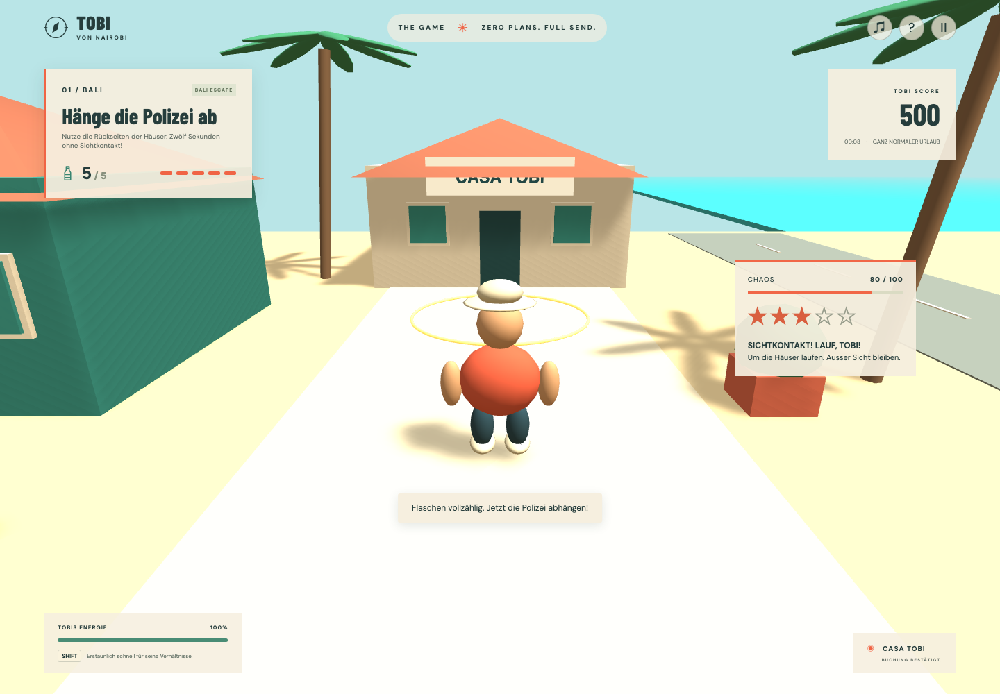

# Bali Escape: erster Flucht-Loop

Auf dem Startbildschirm führt **NEU: BALI ESCAPE →** zum separaten Level `bali_mvp_escape`. Das bestehende Welcome-to-Bali-Tutorial bleibt polizeifrei. Beide Varianten verwenden denselben kompakten Bali-Blockout; dies ist noch keine finale 5–15-Minuten-Kampagnenmission.

## Spielen

Fünf Flaschen sammeln, Security/Polizei auf sich aufmerksam machen, den Sichtkontakt zwölf Sekunden lang unterbrechen und dann mit E in der Casa Tobi einchecken. Die Häuser links vom Weg bieten Deckung. Ein geprüfter Weg führt nach der fünften Flasche links am grünen Bungalow entlang, um dessen Rückseite und auf der anderen Seite wieder nach Süden. Sprint gezielt für die Ecken aufheben; auf freier Strecke sind Verfolger etwas schneller als Tobis normales Gehen.

R lässt Tobi «Ich kenne Karl!» rufen: +20 Chaos, drei Sekunden Abklingzeit. Damit lässt sich auch nach einer frühen Flucht eine weitere Verfolgung auslösen. Karl selbst greift noch nicht ein. Wird Tobi 1,6 Sekunden lang aus nächster Nähe festgehalten, endet der Durchlauf mit **Erwischt**. Abstand baut die Festnahmeanzeige wieder ab. Ein neuer Versuch setzt den gesamten Lauf zurück.

## Regeln und Grenzen

- Flasche: +16 Chaos, +100 Punkte; jede konkrete Flasche zählt nur einmal.
- Ab zehn ruhigen Sekunden sinkt Chaos um 1,5 pro Sekunde. Sichtkontakt unterbricht den Abbau.
- Fahndung steigt bei 41/61/71/81/95 Chaos auf bis zu fünf Sterne. Bali begrenzt dies auf drei Sterne und drei Figuren: einen Security-Mitarbeiter und zwei Polizisten.
- Sinkendes Chaos entfernt keine aktive Fahndung. Erst tatsächlicher Sichtkontakt und anschliessend zwölf Sekunden ohne Sichtkontakt führen zur Flucht. Jede erneute Sichtung setzt den Countdown zurück.
- Sichtweite: 15 Meter, bewusst 360° für diesen Arcade-Prototyp. Raycasts auf Augenhöhe berücksichtigen die realen festen Gebäude; niedrige Hindernisse verdecken die Sicht nicht automatisch.
- Gegner verwenden ein statisches Bodengitter mit einem Meter Rasterweite und 0,5 Metern Kollisionsabstand. Exakte Segmentprüfungen verhindern das Schneiden dünner Wände. Wege werden höchstens etwa alle 0,6 Sekunden neu gesucht, Wahrnehmung läuft mit etwa 10 Hz, Bewegung im festen Spieltakt.
- Flucht: +500 Punkte; Levelabschluss: einmalig +500 Punkte. Ein direkter erfolgreicher Durchlauf ergibt 1'500 Punkte. Punkte sind lokal und nicht für öffentliche Highscores validiert.
- Das Missionsziel `escapePolice` wird erst nach den fünf Flaschen aktiv. Eine frühere Flucht überspringt diese Bedingung nicht. E schliesst den Lauf nur nach der aktiven Fluchtbedingung und ohne laufende Fahndung ab.

## Zuständigkeiten

| Bereich                                      | Modul                                          |
| -------------------------------------------- | ---------------------------------------------- |
| Geräteaktionen einschliesslich R             | `KeyboardInput` → `InputActions`               |
| Chaos                                        | `game-core/chaos/chaos.ts`                     |
| Fahndung und Countdown                       | `game-core/wanted/wanted.ts`                   |
| Individuelle Zustandsmaschine                | `game-core/police/police-agent.ts`             |
| Trupp, Wahrnehmungstakt, Bewegung, Festnahme | `game-core/police/pursuit.ts`                  |
| Enginefreies Routing                         | `game-core/navigation/navigation-grid.ts`      |
| Echte Collider/Raycast-Adapter und Figuren   | `game-client/runtime/police/police-runtime.ts` |
| Missionsreihenfolge, Grenzen, Spawns         | `game-data/levels/bali-escape.json`            |
| Zeit-, Geschwindigkeits- und Chaoswerte      | `game-data/pursuit-balancing.ts`               |
| UI-Projektion                                | `PursuitView` und `PursuitHud`                 |

`PATROL → SUSPICIOUS → CHASE → SEARCH → RETURN_TO_PATROL` ist die erste FSM-Ausbaustufe. `PATROL` bezeichnet aktuell einen Wachposten am Startpunkt. Ein suchender Gegner bekommt nur die letzte bestätigte Sichtposition; keine unsichtbare Live-Spielerposition. Nach einer Flucht kehren die Figuren zu ihren Posten zurück. Keine Bali-spezifischen Regeln stehen in den Core-AI-Klassen.

Alle Zeiten verwenden Simulationszeit: Pause friert Verfolgung und Cooldowns ein. Neustart/Levelwechsel entsorgt die alten Ressourcen und erstellt einen neuen Zustand. F1 zeigt im Entwicklungsbuild zusätzlich Verfolgerpositionen, Zustände und Fahndungsdaten. Der Produktionsbuild enthält das Developer-Menü weiterhin nicht.

## Nachweise und nächste Ausbaustufen

Unit-Tests prüfen Heat-/Wanted-Trennung, Countdown-Reset, Kontaktpflicht, einmalige Ereignisse, Wiederanlocken, Missionsgates, Routing und dünne Wände. Der Browser-Integrationstest fährt einen vollständigen Fluchtweg mit dem echten Havok-Controller, Stamina, Pickups, Sicht-Raycasts und Missionssystem ab, ohne Teleport oder Abschluss-Hook. Der E2E-Test bedient die produktive Oberfläche bis zur Festnahme und prüft den Neustart. Das ursprüngliche Tutorial bleibt ebenfalls E2E-geprüft.

Noch offen: Patrouillenrouten, Sichtkegel, Verkehr, Backup/Strassensperren, dynamisches Navmesh, ausgearbeitete Polizei-Animationen/Sirenen, Kombos, Inventar/Power-ups, Risiko-Scoremultiplikatoren und persistente Spielstände. Die 60-FPS-Abnahme auf Referenzgeräten ist eine separate Aufgabe; Software-Rendering in der CI ersetzt sie nicht.
