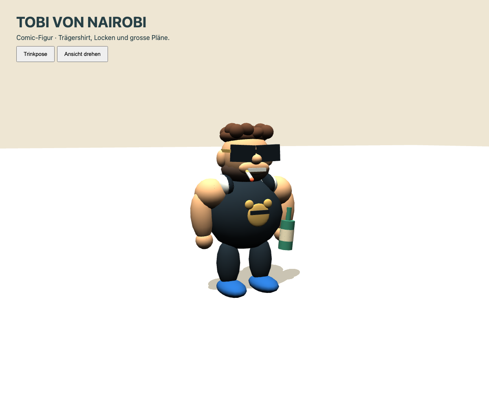
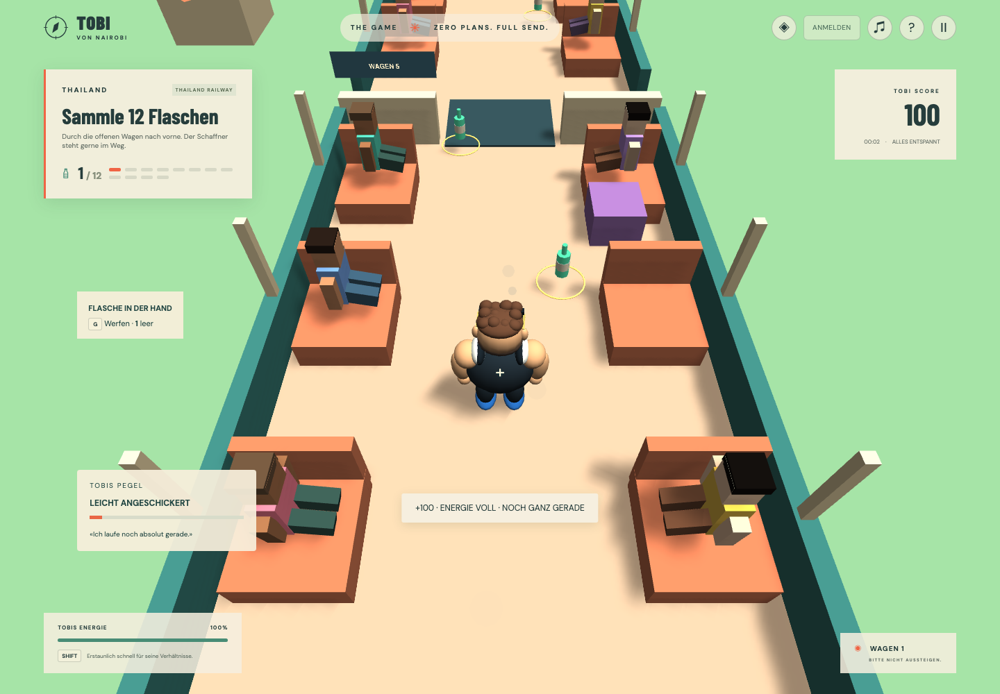
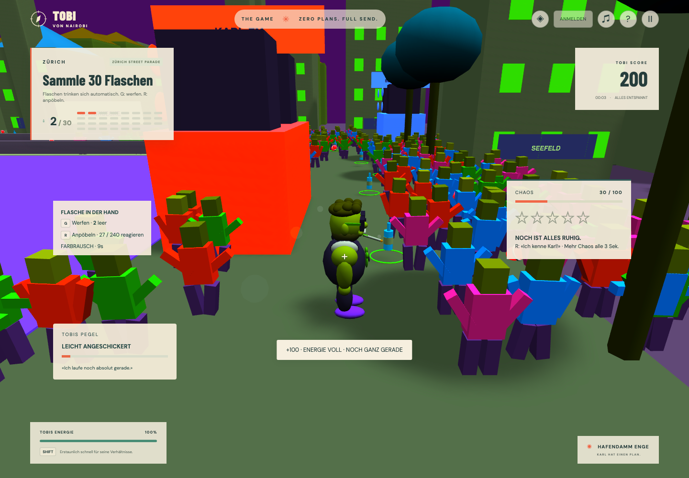

# Tobi, Wurfflaschen und zwei neue Kapitel

Stand: 14. September 2026. **LEVEL WÄHLEN** bietet acht direkt startbare Level. Neue Inhalte ergänzen die vier Bali-Level unter eigenen IDs. Vor dem Start anmelden, um Abschlüsse zu speichern; als Gast sind sämtliche Level ebenfalls spielbar.

## Comic-Figur aus den Referenzen

Die prozedurale Spielfigur übernimmt braune Locken mit kurzen Seiten, kantige dunkle Sonnenbrille, kurzen Bart, breites Gesicht, kräftige Schultern, schwarzen Tanktop mit hellem Rand und eigenem Bärenmotiv, schwarze Shorts, blaue Schuhe und Zigarette. Die Geometrie ist eine stilisierte Annäherung; sie verwendet keine Fototexturen. Die gelieferten Originalfotos in `tmp/` bleiben lokal und sind in Git ausgeschlossen.

**Die Zigarette qualmt.** `CigaretteSmoke` hängt an der Glut und lässt alle 0,42 Sekunden eine Rauchwolke aufsteigen, die driftet, wächst und ausblendet. Neun wiederverwendete Kugeln genügen dafür; ein Partikelsystem hätte ein zusätzliches Babylon-Modul in den Client geholt.

`runtime/character/tobi-likeness.ts` hält die Details getrennt von Gelenken und Animation in `tobi-visual.ts`. Die Figur bleibt für spätere GLB-Assets austauschbar. Für die visuelle Abnahme gibt es im laufenden Entwicklungsclient die [Figurenwerkstatt](http://localhost:5173/test/character.html), mit Drehung und Trinkpose. Die Werkstatt wird nicht in den Produktionsbuild eingebunden.

## Aufnehmen → trinken → halten → werfen

Eine erstmals bestätigte Flaschenaufnahme zählt sofort für Mission, Chaos und Punkte. `BottleHands` reiht jede Aufnahme in eine Trinksequenz von **0,85 Sekunden** ein. Erst nach dem Schluck steigen Pegel und Leergutbestand. Die sichtbare Flasche bewegt sich mit dem Arm zum Mund und bleibt danach in der Hand. Mehrere schnelle Pickups werden nacheinander verarbeitet.

Eine aufgenommene Flasche füllt ausserdem **die Energie vollständig auf** und hebt eine Erschöpfung auf. Der Lauf dreht sich damit um Tempo statt um Stamina-Haushalten: wer sammelt, darf sprinten.

**G** wirft eine leere Flasche **in die Richtung, in die Tobi gerade schaut** — Gierwinkel und Neigung kommen beide aus dem Kamerarig. Nach oben blicken lobbt die Flasche, nach unten blicken schmettert sie vor die Füsse; die Wurfneigung ist auf −0,55 bis +0,95 Radiant begrenzt. Zusammen mit der 360°-Kamera ist damit jede Richtung erreichbar, auch im Zuggang und in der WG. Ein Wurf verbraucht genau eine Flasche, hat 0,45 Sekunden Cooldown und kann keine weiteren Sammelpunkte erzeugen. Die Darstellung zeigt eine Flasche stellvertretend für den gezählten Leergutbestand. Flugbahnen verwenden Geschwindigkeit und Schwerkraft; pro Tick wird die durchflogene Strecke gegen Geometrie und Figuren geprüft. Eine nähere Wand verhindert einen Treffer dahinter. Maximal acht Flaschen gleichzeitig; Treffer, Boden oder drei Sekunden Flugzeit entfernen sie.

Getroffene aktive Guards bleiben **2,5 Sekunden** stehen und verlieren ihren aktuellen Fangfortschritt. Danach verfolgen sie normal weiter. Ihr Sichtkontakt bleibt während des Taumelns aktiv: Ein Treffer allein löst keine erfolgreiche Flucht aus. Passanten erschrecken, heben die Arme und laufen kurz weg. Auch **R** erschreckt alle erreichbaren Figuren im Umkreis von acht Metern; Hindernisse blockieren die Reaktion. In Verfolgungslevels erzeugen Würfe und Zurufe zusätzlich Chaos.

Handbestand, Flugbahnen, Pegel und Farbzustand sind Runtime-Daten. Pause friert sie ein; Neustart und Levelwechsel setzen sie zurück. PostgreSQL speichert weiterhin bestätigte Levelergebnisse, keine fliegenden Flaschen oder laufenden Trinkgesten.

## Thailand Railway

**Aufgabe:** „Falscher Wagen. Richtige Richtung.“ Tobi startet im hintersten Wagen, sammelt zwölf Flaschen und erreicht Wagen 1. Dort schliesst **E** die Zugfahrt ab. Keine Polizei; 1'700 Punkte inklusive Abschlussbonus.

Eigenständige Kulisse mit **fünf** offenen Wagen, Sitzreihen, Gepäck, Türen, Übergängen, Gleisen und vorbeiziehenden Schwellen. Die Kamera blickt erhöht in den Innenraum; das Dach verdeckt die Figur nicht. Sie lässt sich inzwischen **vollständig um die Figur drehen**, damit auch der Rückweg lesbar bleibt; nur die Neigung ist begrenzt. Unsichtbare seitliche Sicherheitswände verhindern das Herausspringen, ohne die Kamera zu blockieren. Die Physik verwendet einen zusammenhängenden Boden; die Fahrbewegung der Umgebung ist visuell.

**Der mittlere Wagen ist ein Barwagen:** durchgehende Teaktheke, Messingauflage, elf Hocker, ein Flaschenregal an der Wand und drei Stehtische auf der anderen Seite. Statt Sitzreihen gibt es hier Barpersonal und stehende Gäste.

In den übrigen Wagen sitzen **Reisende auf den Bänken**. Ein deterministisches Muster lässt Plätze frei, damit der Zug nicht wie ein Pendlerzug zur Hauptverkehrszeit wirkt. Ein Flaschentreffer oder ein Zuruf lässt sie zusammenzucken und die Arme heben; sie melden nichts weiter.

### Der Schaffner

Ein **Schaffner** patrouilliert den Mittelgang und nimmt seine Zuständigkeit sehr ernst. Kommt Tobi auf neun Meter heran, stellt er sich zwischen ihn und die Zugspitze, ruft «Ticket! TICKET!» oder «Kein Ticket, kein Wagen eins.» und verschiebt Tobi körperlich aus seinem Körperradius. Das HUD meldet **DER SCHAFFNER STEHT IM WEG**.

Er ist ausdrücklich **kein Polizist**: er erzeugt kein Chaos, keine Fahndung und keine Festnahme. Und er gibt immer nach — nach fünf Sekunden Blockade stellt er sich sieben Sekunden lang an die Sitze, und ein Zuruf mit **R** oder eine Flasche an die Mütze lässt ihn sofort Platz machen. Damit kann ein Gang-Level nie unpassierbar werden; ein Unit-Test hält genau das fest.

Der Mittelgang bleibt durchgängig begehbar, Gepäck und Sitzreihen laden zu kleinen Umwegen ein. Wagenbeschriftungen geben die Richtung vor. Eigener rhythmischer Schienen-Sound begleitet die Fahrt. Tickets, Fahrplan, Getränkebestellung und endgültige 5–15-Minuten-Dauer sind spätere Erweiterungen.

## Zürich Street Parade

**Aufgabe:** 30 Flaschen entlang der Route sammeln, die Polizei abschütteln und den Hafendamm Enge erreichen.

Die Strasse ist kein gerader Korridor mehr, sondern ein **Ausschnitt des Zürcher Seebeckens** auf 104 × 108 Metern. Die Route folgt der realen Reihenfolge: **Utoquai → Bellevue → Quaibrücke → Bürkliplatz → General-Guisan-Quai → Hafendamm Enge**. Dazu kommen Sechseläutenplatz mit Opernhaus, Bahnhofstrasse mit Tramgleisen, Hauptbahnhof, die Altstadt beidseits der Limmat mit Fraumünster und Grossmünster, die Münsterbrücke, Seefeld, der Chinagarten am Zürichhorn sowie Uetliberg und Alpen als Silhouette am Horizont.

**Zürichsee und Limmat sind echte Hindernisse.** Die Wasserflächen sind Navigationshindernisse für Tänzer und Polizei, unsichtbare Quaimauern halten Tobi an Land, und die beiden Brücken sind die einzigen Übergänge. Die Brückendecks liegen bündig auf der Bodenplatte — eine erhöhte Platte hätte die Kapsel an beiden Brückenköpfen gestoppt.

Die **30 Flaschen liegen nicht mehr in einer Linie**, sondern verteilt: entlang der Quais, auf der Brücke, am Bürkliplatz, als Abstecher die Bahnhofstrasse hinauf und in die Altstadt. Vier Musik-Trucks stehen an den Stationen und dienen als Deckung. Position und Route sind in `game-data/zurich.ts` autoriert; ein Unit-Test stellt sicher, dass keine Flasche, keine Tablette, kein Spawn und kein Polizeiposten in einem Gebäude, unter einem Truck oder im Wasser liegt.

**240 einzeln reagierende Tänzer** werden entlang der Routenlinie ausgestreut statt in festen Spalten platziert: Der Generator läuft den Streckenzug ab, fächert seitlich auf und behält nur Positionen, die das Navigationsgitter als begehbar meldet. R pöbelt alle Figuren in Reichweite an; der HUD-Zähler zählt jede erschreckte Figur pro Run höchstens einmal, auch nach einem Flaschentreffer.

**24 Tabletten** liegen neben der Sammelroute. Jede startet oder verlängert den rein visuellen Farbrausch um zehn Sekunden, bis maximal 24 Sekunden Restzeit. Farbton und Sättigung der Spielwelt verändern sich langsam; HUD und Menüs bleiben lesbar. Keine realen Medikamentennamen, Dosierungen oder Wirkungsmodelle. Bewegung, Stamina, Polizei und Score bleiben unverändert. Der Effekt klingt aus, lässt sich über **◈** reduzieren und startet bei `prefers-reduced-motion` reduziert. Diese Option gilt für die laufende App-Sitzung.

Fünf Chaos pro Flasche aktivieren bis zu drei Guards mit 5,4 m/s. Häuserzeilen, Trucks und die Altstadtgassen brechen Sichtlinien; neun Sekunden unentdeckt bleiben, dann zum Hafendamm. Der Browsertest läuft die gesamte Route mit echter Havok-Bewegung ab und prüft zusätzlich, dass Tobi nie auf dem Wasser steht, das Becken nicht durchqueren kann und das Navigationsgitter über die ganze Platte hinweg Wege findet — in wenigen Millisekunden, weil die Hindernisse jetzt räumlich indiziert sind.

Die Menge verwendet sechs Thin-Instance-Batches. Jede Person hat eigenen Reaktions-/Bewegungszustand; sie teilen ihre Rendergeometrie. Darstellungsdaten werden mit 20 Hz aktualisiert, Bewegung läuft im festen Simulationstick. Es gibt keine 240 Physikkörper und keine Crowd-gegen-Crowd-Kollision: Tobi kann durch die Menge navigieren. Flaschen prüfen die individuellen Treffervolumen; Häuser und Trucks bleiben solide Hindernisse. Das ist eine Arcade-Menge, noch keine vollständige Bürger- oder Dialogsimulation.

Eigener synthetisierter Kick/Bass-Rhythmus plus Trink-, Wurf-, Klirr- und Power-up-Cues ergänzen die vorhandenen Sounds. Alle verwenden denselben begrenzten Stimmenpool, Stummschaltung und Pause. Soundgestaltung mit Kopfhörern sowie 60 FPS auf Referenzhardware bleiben manuell abzunehmen.

## Module und Nachweise

- `contracts/content`: weitere Worlds, Kulissentypen und getrennte, eindeutig identifizierte Power-up-Platzierungen.
- `game-data/zurich.ts`: Zürcher Stadtgeometrie, Wasserflächen, Brücken und Routenlinie als einzige Quelle für Szene, Menge und Platzierungstest.
- `game-data/railway.ts`: Wagenpositionen, Barwagen-Index und die Kennwerte des Schaffners.
- `game-core/character/blocker.ts`: enginefreie Blockierlogik mit garantiertem Nachgeben.
- `runtime/levels/nav-obstacles.ts`: die eine Regel, nach der Collider zu Navigations- und Sichthindernissen werden — von Polizei, Menge und Passanten gemeinsam genutzt.
- `game-data/levels`: zwei JSON-Missionen mit normalen Collect-/Escape-/Reach-Handlern. Bestehende IDs und Wertungen bleiben kompatibel, keine Datenbankmigration erforderlich.
- `game-core/items`: enginefreie Trinkwarteschlange und begrenzter Farb-Timer; `character/reactive-crowd`: individuelle Reaktionen und Navigation über Ports.
- `runtime/levels`: eigenständige Zug-/Paradeszenen, gemeinsamer Szenenbaukasten, instanziierte Menge.
- `runtime/items`: geteiltes Flaschenmodell, Projektile und Farb-Pickups. `GameHost` verbindet Input, Gameplay, Sound und HUD.
- Unit-Tests prüfen Trinkreihenfolge, Leergutverbrauch, Cooldowns, deduplizierte Tabletten, Ablauf und Crowd-Reaktionen mit Hindernissen.
- Browser prüft Wurf-/Wandkollision, Guard-Taumelei und Erholung, vollständige Parade-Flucht, Zugfahrt inklusive Ziel, echte Trink-/Wurfeingaben, Pöbeln, Tabletten, Filterreduktion und Neustart.
- PostgreSQL-Integration prüft Parade-Fluchtbedingung sowie den gespeicherten Zugabschluss ohne Polizeibedingung. Vorhandene Konto-/Retry-Tests bleiben in der Suite.
