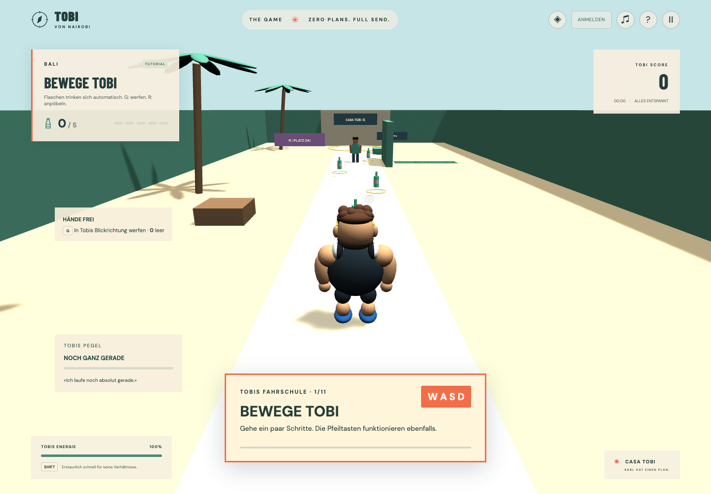
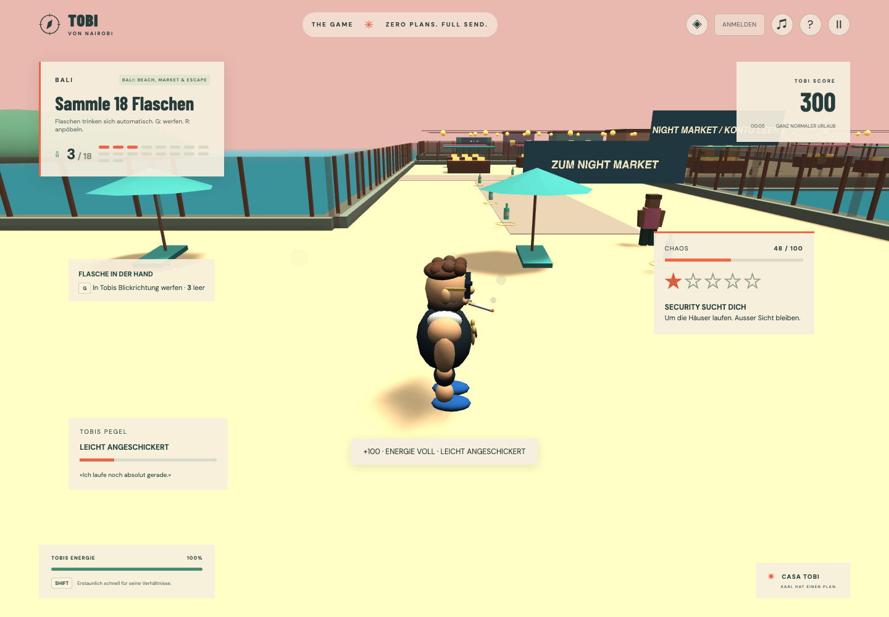

# Tutorial und zusammenhängende Bali-Küste

## Tutorial

„Welcome to Bali“ heisst jetzt **Tutorial**. Die bestehende ID `welcome_to_bali_prototype` bleibt erhalten, damit alte gespeicherte Ergebnisse weiterhin zugeordnet werden können. Die erste Karte der Galerie bleibt vorausgewählt. Die neue Übungsanlage besitzt eine Sichtschutzwand, Übungspartner, freie Bank und fünf Flaschen auf einem hellen Weg. Sie ist von sichtbaren Gartenmauern und Meer umgeben.

Eine grosse, nicht modale Anleitung zeigt immer die aktuelle Aufgabe. Das Spiel läuft weiter, damit die angezeigte Aktion direkt ausgeführt werden kann. Reihenfolge:

1. Drei Meter gehen (WASD/Pfeile).
2. Kamera bewegen (Maus oder Ziehen bei abgelehntem Mausfang).
3. Tatsächlich springen (Space).
4. Eine Sekunde beim Laufen sprinten (Shift).
5. Fünf Flaschen sammeln; früh gesammelte Flaschen zählen mit.
6. Automatisches Trinken und Leergut erklären.
7. Erfolgreich mit G werfen. Wer seine Flaschen schon verbraucht hat, erhält eine Übungsflasche ohne zusätzliche Punkte.
8. In Reichweite des Übungspartners R drücken.
9. Hinter die grüne Wand gehen; die tatsächliche Sichtprüfung muss Deckung melden.
10. Die Bank mit E benutzen und kurz sitzen.
11. Mit E wieder aufstehen; danach CASA TOBI erreichen und mit E abschliessen.

Die Bank nutzt dieselbe `Seating`-Komponente wie Flugzeug und Zug. Kamera, Pause, Bewegung und Lautstärke bleiben während der Anleitung verfügbar. Die Abschlussbedingung wird erst nach allen Übungen freigegeben.

### Neue Spieleraktionen ergänzen

- In `packages/game-data/src/tutorial.ts` eine Lektion mit stabiler ID, Text, Taste, bestätigtem Messwert und Schwelle hinzufügen.
- Benötigte Gegenstände/Stationen in `runtime/levels/tutorial-scene.ts` und Anker in `tutorialLayout` ergänzen.
- Eine bestätigte Aktion im Session-Schritt als Signal melden. Keine rohen DOM-Tasten im Regelmodul lesen.
- Falls ein neuer Messwert nötig ist, `LessonMetric` und die Signalprojektion ergänzen. Die Reihenfolgelogik selbst benötigt keinen neuen Fall.
- In `tests/helpers/tutorial.ts` den echten Eingabeweg ergänzen. Dieser Helfer wird auch für den angemeldeten Speicher-/Reloadtest benutzt; eine neue Lektion darf keinen Skip- oder Debug-Abschlussweg benötigen.

## Bali: Beach, Market & Escape

Die vorherigen drei separaten Karten werden durch **ein zusammenhängendes Level** mit ID `bali_adventure` ersetzt. Die alten IDs bleiben in `allLevels` zur Anzeige vorhandener Spielstände und für bestehende Physikregressionen erhalten, sind aber `selectable: false`. Alte Bestzeiten werden nicht mit dem neuen, grösseren Kurs verglichen; dessen Fortschritt beginnt separat.

Die begehbare Fläche ist eine Vereinigung von fünf Bodenbereichen statt einer rechteckigen schwebenden Platte:

- **Strandbar** im Südwesten: sandige Terrasse, Bartheke, Sonnenschirme, Palmen und Meer.
- **Verbindungsgasse** nach Norden: bewusst schmaler Übergang.
- **Nachtmarkt** im östlichen Querarm: Verkaufsstände, Waren, bunte Dächer, Laternen und breite Kreuzungen.
- **Altstadt** im Norden: versetzte Häuser, T-Kreuzungen, Hintergassen und CASA TOBI als Fluchtziel.

Kaimauern, Bambuszäune und Felsen folgen dem tatsächlichen Küstenumriss. Wasserflächen sind ausdrücklich als Navigationshindernisse markiert; keine unsichtbare Bodenplatte verbindet die ausgeschnittenen Ecken. Es gibt 18 Flaschen, drei Fahndungsstufen und eine verpflichtende echte Flucht nach der Sammlung. Alternative Gassen hinter den Häusern unterbrechen Sichtkontakt.

`bali-adventure.ts` enthält Grundriss, Referenzroute und Gebäude. Der Physiktest läuft die ganze Route mit echten Havok-Kollisionen und Polizeisichtlinien; kein Teleport hilft beim Levelabschluss. Der Szenenbauer erstellt die Küstengrenze aus dem Umriss der Bodenvereinigung. Für eine Erweiterung zuerst diese Daten und die Platzierungsprüfung anpassen.

## Würfe und Zugfahrt

Würfe benutzen jetzt **Tobis letzte Bewegungsrichtung**, unabhängig von der Kameradrehung. Zuvor lief eine seitwärts gedrehte Figur mit unveränderter Kamera weiterhin in die Kamera-Vorwärtsrichtung werfend herum. `CharacterFacing` hält die Richtung auch im Stillstand fest; die Wurfanimation richtet Tobi vor dem Abwurf aus. Der feste Wurfbogen bleibt in engen Innenräumen lesbar. Ein Browsercheck trifft Ziele in allen vier Himmelsrichtungen bei feststehender Kamera.

Im Zug bewegen sich Gebäude, Palmen, Felder und Schwellen nach hinten. 16 wiederverwendete Landschaftsstreifen werden ausserhalb der nahen Spielfläche umgebrochen; auch nach vielen Minuten kommen neue Landschaften vorbei. Die Wagen und ihre Kollisionskörper bleiben für stabile Bewegung lokal fest. Der Browsercheck prüft Bewegung, begrenzte Objektanzahl und unveränderte Collider über 2000 simulierte Sekunden.

